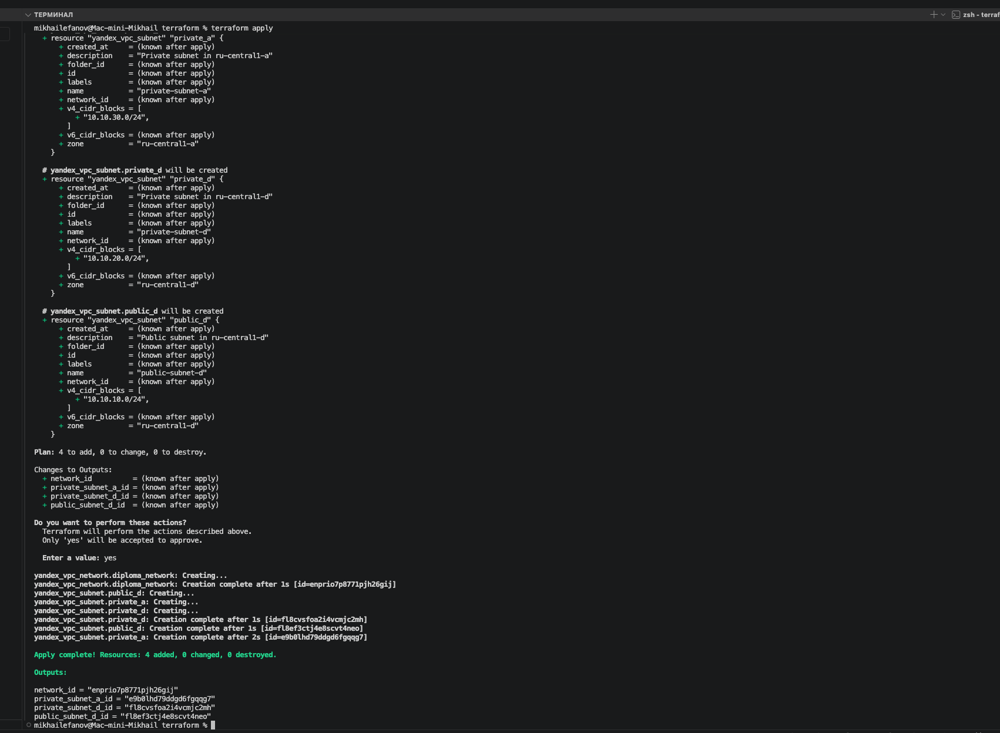
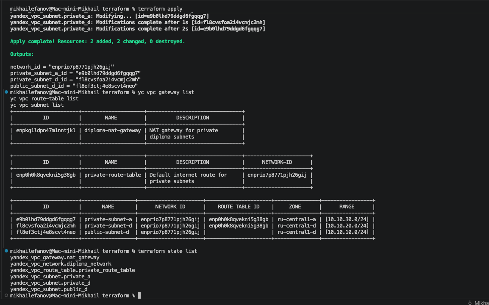
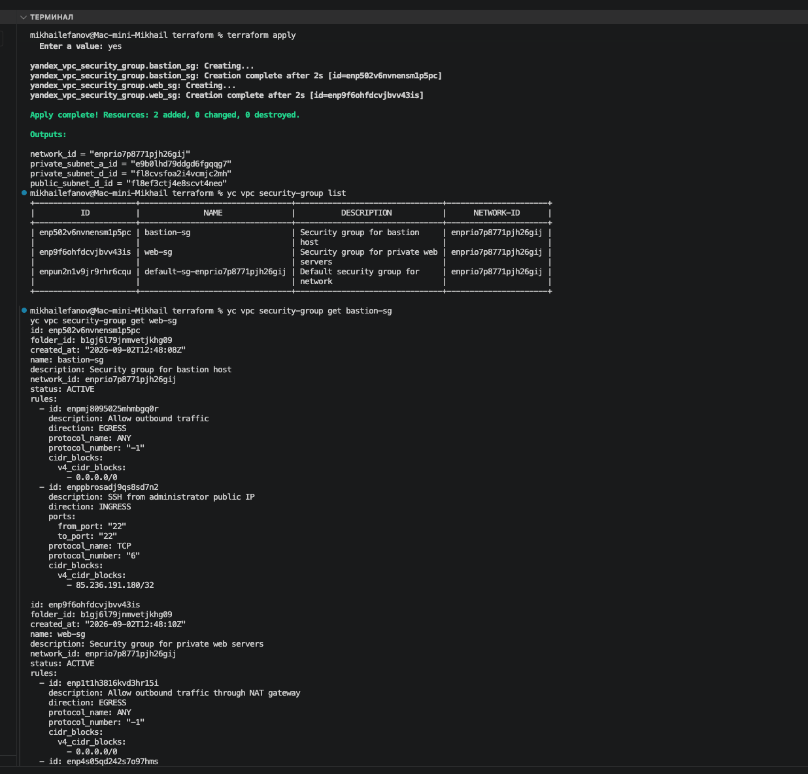
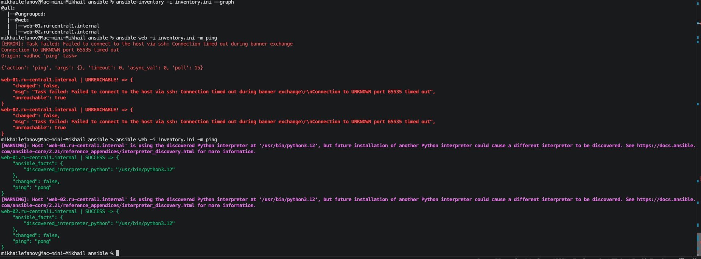

# Дипломная работа по профессии «Системный администратор»
    
    Выполнил студент Ефанов Михаил Евгеньевич
    
    ## Доступ к развёрнутой инфраструктуре

На момент завершения дипломного проекта используются следующие публичные адреса:

| Компонент | Адрес | Назначение |
|---|---|---|
| Application Load Balancer | `81.26.178.111` | Доступ к веб-приложению |
| Bastion Host | `158.160.202.52` | SSH-доступ к приватным виртуальным машинам |
| Zabbix | `81.26.178.171` | Интерфейс системы мониторинга |
| Kibana | `84.201.147.163:5601` | Просмотр и анализ централизованных логов |

### Веб-приложение

Основная точка входа в приложение:

`http://81.26.178.111`

Проверка состояния приложения:

`http://81.26.178.111/health`

Проверка готовности приложения и соединения с PostgreSQL:

`http://81.26.178.111/ready`

### Внутренняя адресация

Приватные виртуальные машины не имеют публичных IP-адресов и доступны по SSH через Bastion Host.

| VM | Внутренний IP |
|---|---|
| web-01 | `10.10.20.12` |
| web-02 | `10.10.30.24` |
| Elasticsearch | `10.10.20.9` |
| db-01 (STANDBY) | `10.10.20.4` |
| db-02 (PRIMARY) | `10.10.30.9` |


## Содержание

1. Введение
2. Этап 1 — Подготовка рабочего окружения и структуры проекта
3. Этап 2 — Настройка Terraform и безопасной авторизации в Yandex Cloud
4. Этап 3 — Создание VPC и подсетей
5. Этап 4 — Настройка NAT Gateway и маршрутизации приватных подсетей
6. Этап 5 — Настройка Security Groups для Bastion и web-серверов
7. Этап 6 — Создание и настройка Bastion Host
8. Этап 7 — Создание приватных web-серверов и проверка доступа через Bastion
9. Этап 8 — Настройка Ansible Inventory и проверка подключения
10. Этап 9 — Автоматическая установка и проверка nginx с помощью Ansible
11. Этап 10 — Настройка Yandex Application Load Balancer и проверка отказоустойчивости
12. Этап 11 — Развёртывание сервера мониторинга Zabbix
13. Этап 12 — Подключение web-серверов к Zabbix через Zabbix Agent 2
14. Этап 13 — Восстановление SSH-доступа к Bastion и закрепление статического IP
15. Этап 14 — Настройка мониторинга всей инфраструктуры в Zabbix
16. Этап 15 — Развёртывание приватного сервера Elasticsearch
17. Этап 16 — Установка Filebeat и передача журналов nginx в Elasticsearch
18. Этап 17 — Развёртывание Kibana и визуализация централизованных журналов
19. Этап 18 — Настройка автоматического резервного копирования дисков VM
20. Этап 19 — Завершение мониторинга всех виртуальных машин в Zabbix
21. Этап 20 — Развёртывание PostgreSQL Primary/Standby и настройка Streaming Replication
22. Этап 21 — Добавление PostgreSQL-серверов в автоматическое резервное копирование
23. Этап 22 — Проверка отказоустойчивости PostgreSQL и ручного Failover
24. Этап 23 — Развёртывание собственного веб-приложения на отказоустойчивой инфраструктуре
25. Этап 24 — Итоговая проверка соответствия требованиям дипломного проекта

## Введение 


В процессе выполнения дипломного проекта я старался фиксировать ход работы и сохранять материалы, которые могли пригодиться при подготовке итогового отчёта. Сохранялись ссылки на документацию и найденные решения, результаты выполнения команд в терминале, сообщения об ошибках, отдельные ответы нейросетевых инструментов, а также скриншоты различных этапов настройки и проверки инфраструктуры.

К завершению проекта таких материалов накопилось достаточно много, при этом они представляли собой скорее набор рабочих заметок, чем готовую документацию. Поэтому было принято решение собрать их в данном README и оформить в виде дневника выполнения дипломного проекта: от первоначальной подготовки Yandex Cloud до развёртывания приложения и итоговой проверки инфраструктуры.

Поскольку подготовка самого README не является частью проверки полученных мной знаний по системному администрированию, для экономии времени при его составлении активно использовалась нейросеть. Ей был передан собранный в процессе работы материал: команды и их результаты, конфигурации, описания возникших ошибок, ссылки, скриншоты и рабочие заметки. С помощью нейросети этот материал был структурирован, очищен от повторов и приведён к единому формату отчёта. Поэтому данный файл следует рассматривать именно как оформленный дневник фактически выполненной работы, а не как последовательность текста, написанного вручную непосредственно во время выполнения каждого этапа.

Целью самой дипломной работы является развёртывание в Yandex Cloud отказоустойчивой инфраструктуры для веб-сайта с использованием Terraform и Ansible. В соответствии с заданием необходимо было создать два веб-сервера в разных зонах доступности, настроить Application Load Balancer, организовать доступ к закрытым виртуальным машинам через Bastion Host, настроить NAT Gateway, мониторинг на базе Zabbix, централизованный сбор логов с помощью Filebeat, Elasticsearch и Kibana, а также ежедневное резервное копирование дисков виртуальных машин.

При выполнении работы я старался не ограничиваться только созданием ресурсов, необходимых для формального выполнения задания. Для меня было важно разобраться, как отдельные компоненты взаимодействуют между собой и как построенная инфраструктура может использоваться для размещения реального приложения.

Параллельно с обучением по направлению системного администрирования я прохожу курс по Python-разработке. В процессе обучения у меня появился собственный веб-проект на Python с использованием FastAPI, который также дорабатывался с помощью ИИ-агента. Поэтому вместо предложенного в задании статического сайта я решил развернуть в созданной инфраструктуре собственное приложение и приблизить его запуск к реальному production-сценарию.

В результате на двух веб-серверах было развёрнуто одинаковое приложение в Docker-контейнерах. На виртуальных машинах nginx выполняет роль reverse proxy между Application Load Balancer и FastAPI. Для хранения данных дополнительно были созданы две виртуальные машины PostgreSQL и настроена Streaming Replication. В ходе работы также была практически проверена отказоустойчивость web-уровня и выполнен ручной Failover PostgreSQL с переключением приложения на резервный сервер.

На развёртывание и проверку собственного приложения ушла существенная часть дополнительного времени. Поэтому дополнительные задания дипломной работы я решил не выполнять. Вместо расширения инфраструктуры компонентами, не требующимися в основной части задания, я сосредоточился на практической проверке уже построенной системы с реальным приложением. При этом все обязательные компоненты дипломного задания были сохранены: Terraform, Ansible, две web-VM, nginx, Application Load Balancer, Bastion Host, NAT Gateway, Security Groups, Zabbix, Elasticsearch, Filebeat, Kibana и автоматические snapshots.

### Использование источников информации и нейросетевых инструментов

При выполнении технической части проекта основным источником информации являлась официальная документация используемых технологий. При возникновении вопроса я в первую очередь старался найти необходимую информацию в документации Yandex Cloud, Terraform, Ansible, PostgreSQL, Docker, Zabbix, Elasticsearch и других используемых компонентов.

Если официальной документации было недостаточно для понимания конкретной проблемы или требовался пример решения похожей ситуации, дополнительная информация искалась на технических форумах и других профильных ресурсах в интернете.

К нейросетевым инструментам при выполнении самой работы я обращался в тех случаях, когда документация и самостоятельный поиск не позволяли найти причину возникшей проблемы или требовался дополнительный разбор ошибки. В частности, они использовались как вспомогательный инструмент при анализе некоторых ошибок Terraform и Ansible, зависимостей между ресурсами и результатов выполнения команд.

Предложенные таким образом решения не принимались как подтверждение правильности настройки сами по себе. После внесения изменений результат проверялся непосредственно в инфраструктуре с помощью Terraform, Ansible, Yandex Cloud CLI, системных утилит Linux и проверок состояния развернутых сервисов.


В процессе выполнения дипломной работы использовались следующие материалы:

**Исходное задание**

- Дипломная работа Netology «Системный администратор»:  
  https://github.com/netology-code/sys-diplom/tree/diplom-zabbix
- Рекомендации Netology по экономии облачных ресурсов:  
  https://github.com/netology-code/devops-materials/blob/master/cloudwork.MD

**Yandex Cloud**

- Документация Yandex Cloud:  
  https://yandex.cloud/ru/docs/
- Terraform в Yandex Cloud:  
  https://yandex.cloud/ru/docs/terraform/
- Начало работы с Terraform в Yandex Cloud:  
  https://yandex.cloud/ru/docs/terraform/quickstart
- Application Load Balancer:  
  https://yandex.cloud/ru/docs/application-load-balancer/
- Virtual Private Cloud:  
  https://yandex.cloud/ru/docs/vpc/
- Security Groups:  
  https://yandex.cloud/ru/docs/vpc/concepts/security-groups
- NAT Gateway:  
  https://yandex.cloud/ru/docs/vpc/operations/create-nat-gateway
- Bastion Host:  
  https://yandex.cloud/ru/docs/tutorials/routing/bastion
- Compute Cloud:  
  https://yandex.cloud/ru/docs/compute/
- Snapshots и резервное копирование дисков:  
  https://yandex.cloud/ru/docs/compute/concepts/snapshot

**Terraform**

- Документация Terraform:  
  https://developer.hashicorp.com/terraform/docs
- Terraform Language:  
  https://developer.hashicorp.com/terraform/language
- Terraform CLI:  
  https://developer.hashicorp.com/terraform/cli

**Ansible**

- Документация Ansible:  
  https://docs.ansible.com/ansible/latest/
- Ansible Inventory:  
  https://docs.ansible.com/ansible/latest/inventory_guide/intro_inventory.html
- Ansible Playbooks:  
  https://docs.ansible.com/ansible/latest/playbook_guide/playbooks_intro.html

**Docker**

- Документация Docker:  
  https://docs.docker.com/
- Установка Docker Engine на Ubuntu:  
  https://docs.docker.com/engine/install/ubuntu/
- Docker Compose:  
  https://docs.docker.com/compose/

**nginx**

- Документация nginx:  
  https://nginx.org/en/docs/
- HTTP Proxy Module:  
  https://nginx.org/en/docs/http/ngx_http_proxy_module.html

**Zabbix**

- Документация Zabbix:  
  https://www.zabbix.com/documentation/current/en/manual
- Zabbix Agent 2:  
  https://www.zabbix.com/documentation/current/en/manual/concepts/agent2

**Elastic Stack**

- Документация Elasticsearch:  
  https://www.elastic.co/docs
- Elasticsearch:  
  https://www.elastic.co/docs/reference/elasticsearch
- Filebeat:  
  https://www.elastic.co/docs/reference/beats/filebeat
- Kibana:  
  https://www.elastic.co/docs/explore-analyze

**PostgreSQL**

- Документация PostgreSQL 16:  
  https://www.postgresql.org/docs/16/
- High Availability:  
  https://www.postgresql.org/docs/16/high-availability.html
- Warm Standby:  
  https://www.postgresql.org/docs/16/warm-standby.html
- Failover:  
  https://www.postgresql.org/docs/16/warm-standby-failover.html
- pg_basebackup:  
  https://www.postgresql.org/docs/16/app-pgbasebackup.html

**FastAPI и Alembic**

- Документация FastAPI:  
  https://fastapi.tiangolo.com/
- Документация Alembic:  
  https://alembic.sqlalchemy.org/en/latest/
  
  ### Дополнительные статьи и материалы

**Terraform и Yandex Cloud**

- DevOps Tutorials: Terraform — создаём виртуальный сервер в облаке:\
  [https://habr.com/ru/articles/937376/](https://habr.com/ru/articles/937376/)
- Разворачиваем без боли Terraform в Яндекс Облаке:\
  [https://habr.com/ru/companies/otus/articles/957982/](https://habr.com/ru/companies/otus/articles/957982/)
- Создание инфраструктуры в Yandex Cloud с помощью Terraform и Ansible:\
  [https://qna.habr.com/q/1345156](https://qna.habr.com/q/1345156)
- Terraform за 15 дней — Data Source и Outputs:\
  [https://habr.com/ru/articles/685520/](https://habr.com/ru/articles/685520/)

**Ansible и Bastion Host**

- Ansible + Grafana Loki — настройка инфраструктуры и логирования:\
  [https://habr.com/ru/articles/795855/](https://habr.com/ru/articles/795855/)
- Ansible with a Bastion Host / Jump Box:\
  [https://stackoverflow.com/questions/31408017/ansible-with-a-bastion-host-jump-box/36850087](https://stackoverflow.com/questions/31408017/ansible-with-a-bastion-host-jump-box/36850087)
- ansible_ssh_common_args в Inventory:\
  [https://stackoverflow.com/questions/38651791/is-it-possible-to-add-ansible-ssh-common-args-in-inventory-file](https://stackoverflow.com/questions/38651791/is-it-possible-to-add-ansible-ssh-common-args-in-inventory-file)
- Запуск Ansible Playbook через Bastion Host:\
  [https://stackoverflow.com/questions/61056694/execute-playbook-from-localhost-through-bastion-host](https://stackoverflow.com/questions/61056694/execute-playbook-from-localhost-through-bastion-host)

**Security Groups и Terraform**

- Self-reference в Security Group Terraform:\
  [https://discuss.hashicorp.com/t/creating-self-references-in-new-security-group-rule-resource-types/51188](https://discuss.hashicorp.com/t/creating-self-references-in-new-security-group-rule-resource-types/51188)

**Filebeat, nginx, Elasticsearch и Kibana**

- Организация сбора и парсинга логов при помощи Filebeat:\
  [https://habr.com/ru/articles/550352/](https://habr.com/ru/articles/550352/)
- Мониторинг логов Nginx и повышение стабильности веб-приложения:\
  [https://habr.com/ru/companies/otus/articles/695560/](https://habr.com/ru/companies/otus/articles/695560/)
- Почему Filebeat не отправляет логи nginx:\
  [https://qna.habr.com/q/612962](https://qna.habr.com/q/612962)
- Filebeat nginx module и Elasticsearch Pipeline:\
  [https://stackoverflow.com/questions/58654560/how-to-specify-pipeline-for-filebeat-nginx-module](https://stackoverflow.com/questions/58654560/how-to-specify-pipeline-for-filebeat-nginx-module)

**PostgreSQL и Streaming Replication**

- Репликация в PostgreSQL без проблем:\
  [https://habr.com/ru/sandbox/150526/](https://habr.com/ru/sandbox/150526/)
- Настройка pgpool-II + PostgreSQL + Streaming Replication + Hot Standby:\
  [https://habr.com/ru/articles/213409/](https://habr.com/ru/articles/213409/)
- PostgreSQL — проблемы с WAL при Streaming Replication:\
  [https://dba.stackexchange.com/questions/320718/why-is-pg-wal-filling-up](https://dba.stackexchange.com/questions/320718/why-is-pg-wal-filling-up)
- PostgreSQL — Promotion Standby-сервера:\
  [https://dba.stackexchange.com/questions/129616/cant-promote-postgresql-warm-standby-server-to-start-serving-data](https://dba.stackexchange.com/questions/129616/cant-promote-postgresql-warm-standby-server-to-start-serving-data)

**FastAPI, Docker и nginx**

- FastAPI + nginx + Docker — настройка Proxy Pass:\
  [https://stackoverflow.com/questions/72917269/fastapi-nginx-docker-explicitly-add-each-endpoint](https://stackoverflow.com/questions/72917269/fastapi-nginx-docker-explicitly-add-each-endpoint)
- FastAPI + nginx + Docker — Connection Refused:\
  [https://stackoverflow.com/questions/75626093/fastapi-nginx-docker-connection-refused](https://stackoverflow.com/questions/75626093/fastapi-nginx-docker-connection-refused)

## Выполнение.

### Этап 1 - Подготовка

    Выполнены проверка версий на моем хосте, так как данный хост не участвовал в обучении до этого, многое не установлено : 
    


    Выполняю установку :

```bash
brew tap hashicorp/tap
brew install hashicorp/tap/terraform

brew install pipx
pipx ensurepath
pipx install --include-deps ansible
```

    Как подсказал Яндекс поисковить : Ansible — лучше через pipx, чтобы не смешивать его зависимости с системным Python.

    Yandex Cloud CLI ставим официальным установочным скриптом:
```bash
curl -sSL https://storage.yandexcloud.net/yandexcloud-yc/install.sh | bash
```

    После установки : 
```bash    
source ~/.zshrc
```

    Еще раз проверяем, все установлено:


    Проверяем доступ к яндексу через терминал : 


    Таким образом мой хост настроен для выполнения дипломного проекта.
    Mac
     │
     ├── Git ✓
     ├── SSH ✓
     ├── Terraform ✓
     ├── Ansible ✓
     └── Yandex Cloud CLI
       │
       ├── авторизация ✓
       ├── cloud ✓
       ├── folder ✓
       └── доступ к Yandex Cloud API ✓
       
       
       
       
### Этап 2 — Настройка Terraform и безопасной авторизации в Yandex Cloud

Для работы с Yandex Cloud через Terraform в каталоге `terraform` были созданы основные конфигурационные файлы:

```bash
touch versions.tf providers.tf variables.tf outputs.tf
```

Назначение файлов:

- `versions.tf` — требования к версии Terraform и используемому провайдеру Yandex Cloud;
- `providers.tf` — конфигурация подключения Terraform к Yandex Cloud;
- `variables.tf` — переменные, используемые в конфигурации;
- `outputs.tf` — выходные значения создаваемой инфраструктуры.

Для работы Terraform был создан отдельный сервисный аккаунт `terraform-sa`. Это позволяет не использовать основную пользовательскую учётную запись непосредственно для управления инфраструктурой.

```bash
yc iam service-account create \
  --name terraform-sa \
  --description "Service account for diploma Terraform infrastructure"

yc iam service-account get terraform-sa
```

Сервисному аккаунту была назначена роль `editor` на каталог Yandex Cloud:

```bash
yc resource-manager folder add-access-binding \
  --id "$FOLDER_ID" \
  --role editor \
  --service-account-id "$SA_ID"
```

Дополнительно назначена роль `vpc.publicAdmin`, необходимая для работы с публичными сетевыми ресурсами:

```bash
yc resource-manager folder add-access-binding \
  --id "$FOLDER_ID" \
  --role vpc.publicAdmin \
  --service-account-id "$SA_ID"
```

Для получения временного IAM-токена от имени сервисного аккаунта используется механизм impersonation. Пользовательской учётной записи была назначена роль `iam.serviceAccounts.tokenCreator` для `terraform-sa`:

```bash
yc iam service-account add-access-binding terraform-sa \
  --role iam.serviceAccounts.tokenCreator \
  --user-account-id "$USER_ID"
```

После этого временный IAM-токен можно получать без создания и хранения постоянного JSON-ключа:

```bash
export YC_TOKEN=$(yc iam create-token \
  --impersonate-service-account-id "$SA_ID")
```

Идентификаторы облака и каталога также передаются через переменные окружения:

```bash
export YC_CLOUD_ID=$(yc config get cloud-id)
export YC_FOLDER_ID=$(yc config get folder-id)
```

Таким образом, IAM-токен и другие секретные данные не записываются непосредственно в Terraform-конфигурацию и не добавляются в Git-репозиторий.

После настройки авторизации была выполнена подготовка рабочего каталога Terraform.

Сначала конфигурация приведена к стандартному формату:

```bash
terraform fmt
```

Затем выполнена инициализация:

```bash
terraform init
```

Terraform загрузил провайдер `yandex-cloud/yandex` версии `0.225.0` и создал служебный каталог `.terraform` и файл `.terraform.lock.hcl`.

Каталог `.terraform` исключён из Git через `.gitignore`. Файл `.terraform.lock.hcl` используется для фиксации версии провайдера.

Корректность конфигурации проверена командой:

```bash
terraform validate
```

Результат:

```text
Success! The configuration is valid.
```

На этом этапе Terraform подготовлен к управлению ресурсами Yandex Cloud. Облачные ресурсы ещё не создавались.

### Этап 3 — Создание VPC и подсетей

На этом этапе была создана базовая сетевая инфраструктура дипломного проекта в Yandex Cloud.

Для описания сети создан файл `network.tf`. В нём определены одна виртуальная сеть и три подсети:

- `diploma-network` — основная VPC дипломного проекта;
- `public-subnet-d` — публичная подсеть `10.10.10.0/24` в зоне `ru-central1-d`;
- `private-subnet-d` — приватная подсеть `10.10.20.0/24` в зоне `ru-central1-d`;
- `private-subnet-a` — приватная подсеть `10.10.30.0/24` в зоне `ru-central1-a`.

Две приватные подсети в разных зонах доступности создавались для последующего размещения web-серверов в `ru-central1-d` и `ru-central1-a`.

После создания конфигурации Terraform файлы были отформатированы:

```bash
terraform fmt
```

Корректность конфигурации проверена командой:

```bash
terraform validate
```

Результат:

```text
Success! The configuration is valid.
```

Перед созданием ресурсов выполнен предварительный просмотр изменений:

```bash
terraform plan
```

Terraform сформировал план:

```text
Plan: 4 to add, 0 to change, 0 to destroy.
```

План предусматривал создание четырёх ресурсов: одной VPC и трёх подсетей. Изменение или удаление существующих ресурсов не планировалось.

Для создания ресурсов выполнена команда:

```bash
terraform apply
```

При первой попытке Yandex Cloud вернул ошибку:

```text
Quota limit vpc.networks.count exceeded
```

Был достигнут лимит на количество VPC в каталоге. Для проверки существующих сетей выполнена команда:

```bash
yc vpc network list
```

Были обнаружены две сети от предыдущих учебных работ:

```text
test
voip-net
```

Перед удалением была проверена привязка к ним подсетей, Security Groups и таблиц маршрутизации:

```bash
yc vpc network list-subnets test
yc vpc network list-security-groups test
yc vpc network list-route-tables test

yc vpc network list-subnets voip-net
yc vpc network list-security-groups voip-net
yc vpc network list-route-tables voip-net
```

Проверка показала наличие старых учебных ресурсов. Поскольку они больше не использовались, связанные с ними подсети, Security Groups и VPC были удалены средствами Yandex Cloud CLI, после чего квота была освобождена.

Создание инфраструктуры было запущено повторно:

```bash
terraform apply
```

Terraform снова сформировал ожидаемый план:

```text
Plan: 4 to add, 0 to change, 0 to destroy.
```

После подтверждения ресурсы были успешно созданы:

```text
Apply complete! Resources: 4 added, 0 changed, 0 destroyed.
```

Созданная VPC:

```text
diploma-network
ID: enprio7p8771pjh26gij
```

Созданные подсети:

```text
public-subnet-d
ID: fl8ef3ctj4e8scvt4neo

private-subnet-d
ID: fl8cvsfoa2i4vcmjc2mh

private-subnet-a
ID: e9b0lhd79ddgd6fgqqg7
```

Таким образом, средствами Terraform создана основная VPC и три подсети. Две приватные подсети расположены в разных зонах доступности, что позволяет далее разместить web-серверы в разных зонах.




### Этап 4 — Настройка NAT Gateway и маршрутизации приватных подсетей

На этом этапе был настроен исходящий доступ в интернет для виртуальных машин в приватных подсетях без назначения им публичных IP-адресов.

Для описания NAT Gateway и таблицы маршрутизации создан файл:

```bash
touch nat.tf
```

В `nat.tf` определены:

- `diploma-nat-gateway` — NAT Gateway на базе Shared Egress Gateway;
- `private-route-table` — таблица маршрутизации для приватных подсетей;
- маршрут `0.0.0.0/0`, направляющий исходящий трафик через NAT Gateway.

В файле `network.tf` к приватным подсетям `private-subnet-d` и `private-subnet-a` была подключена созданная таблица маршрутизации:

```hcl
route_table_id = yandex_vpc_route_table.private_route_table.id
```

Публичная подсеть `public-subnet-d` к этой таблице не подключалась.

После изменения конфигурации выполнено форматирование Terraform-файлов:

```bash
terraform fmt
```

Затем проверена корректность конфигурации:

```bash
terraform validate
```

Перед применением изменений выполнена проверка плана:

```bash
terraform plan
```

Terraform определил необходимость создания двух новых ресурсов и изменения двух существующих приватных подсетей.

После проверки плана изменения применены:

```bash
terraform apply
```

Результат:

```text
Apply complete! Resources: 2 added, 2 changed, 0 destroyed.
```

Таким образом, NAT Gateway и таблица маршрутизации были созданы, а две существующие приватные подсети подключены к новой таблице без пересоздания.

Для проверки NAT Gateway выполнена команда:

```bash
yc vpc gateway list
```

Созданный ресурс:

```text
diploma-nat-gateway
ID: enpkq1ldpn47m1nntjkl
```

Таблица маршрутизации проверена командой:

```bash
yc vpc route-table list
```

Результат:

```text
private-route-table
ID: enp0h0k8qvekni5g38gb
```

Привязка таблицы маршрутизации к подсетям проверена командой:

```bash
yc vpc subnet list
```

Проверка показала, что `private-subnet-a` и `private-subnet-d` используют таблицу маршрутизации `private-route-table`, а публичная `public-subnet-d` к ней не подключена.

Дополнительно проверено состояние Terraform:

```bash
terraform state list
```

В state находятся следующие сетевые ресурсы:

```text
yandex_vpc_gateway.nat_gateway
yandex_vpc_network.diploma_network
yandex_vpc_route_table.private_route_table
yandex_vpc_subnet.private_a
yandex_vpc_subnet.private_d
yandex_vpc_subnet.public_d
```

В результате приватные подсети получили исходящий доступ в интернет через NAT Gateway без необходимости назначения виртуальным машинам публичных IP-адресов.





### Этап 5 — Настройка Security Groups для Bastion и web-серверов

На этом этапе были настроены группы безопасности для Bastion Host и будущих web-серверов.

Сначала определён публичный IPv4-адрес рабочей станции администратора:

```bash
curl -4 ifconfig.me
```

Результат:

```text
85.236.191.180
```

Для ограничения SSH-доступа только этим адресом используется CIDR:

```text
85.236.191.180/32
```

В `variables.tf` была добавлена переменная `admin_cidr`, а её значение сохранено в локальном файле `terraform.tfvars`:

```hcl
admin_cidr = "85.236.191.180/32"
```

Файлы `*.tfvars` исключены из Git через `.gitignore`. Это было дополнительно проверено командой:

```bash
git check-ignore -v terraform.tfvars
```

Для описания групп безопасности создан отдельный Terraform-файл:

```bash
touch security-groups.tf
```

В нём определены две Security Groups:

- `bastion-sg` — для Bastion Host;
- `web-sg` — для web-серверов.

Для `bastion-sg` разрешён входящий TCP/22 только с адреса администратора:

```text
85.236.191.180/32
```

Исходящий трафик разрешён в направлении:

```text
0.0.0.0/0
```

Для `web-sg` SSH-доступ на TCP/22 разрешён только от ресурсов, которым назначена `bastion-sg`. Благодаря этому прямой SSH-доступ к будущим web-серверам из интернета не требуется — подключение выполняется через Bastion Host.

Для HTTP на TCP/80 разрешён трафик из внутренних подсетей проекта:

```text
10.10.10.0/24
10.10.20.0/24
10.10.30.0/24
```

Отдельным правилом разрешены проверки состояния со стороны Yandex Application Load Balancer:

```text
loadbalancer_healthchecks
```

Исходящий трафик web-серверов разрешён в направлении `0.0.0.0/0`. Для серверов в приватных подсетях такой трафик будет проходить через настроенный ранее NAT Gateway.

После внесения изменений Terraform-конфигурация была проверена:

```bash
terraform fmt
terraform validate
terraform plan
```

Terraform сформировал план:

```text
Plan: 2 to add, 0 to change, 0 to destroy.
```

После проверки плана изменения применены:

```bash
terraform apply
```

Результат:

```text
Apply complete! Resources: 2 added, 0 changed, 0 destroyed.
```

Созданы следующие Security Groups:

```text
bastion-sg
ID: enp502v6nvnensm1p5pc

web-sg
ID: enp9f6ohfdcvjbvv43is
```

Наличие созданных групп проверено командой:

```bash
yc vpc security-group list
```

Для проверки непосредственно правил использованы команды:

```bash
yc vpc security-group get bastion-sg
yc vpc security-group get web-sg
```

Проверка подтвердила:

- `bastion-sg` разрешает SSH только с `85.236.191.180/32`;
- `web-sg` разрешает SSH от `bastion-sg`;
- `web-sg` разрешает внутренний HTTP-трафик;
- проверки состояния Application Load Balancer разрешены отдельным правилом.

Состояние ресурсов Terraform дополнительно проверено:

```bash
terraform state list
```

В Terraform state присутствуют созданные ранее VPC, три подсети, NAT Gateway, таблица маршрутизации и две Security Groups. Таким образом, сетевые ресурсы проекта находятся под управлением Terraform.




### Этап 6 — Создание и настройка Bastion Host

Для безопасного администрирования виртуальных машин в приватных подсетях был создан отдельный Bastion Host. Он размещён в публичной подсети `public-subnet-d` в зоне `ru-central1-d` и используется как единая точка SSH-доступа во внутреннюю инфраструктуру.

Для дипломного проекта создана отдельная SSH-пара ключей:

```bash
ssh-keygen -t ed25519 \
  -f ~/.ssh/diploma_yc \
  -C "diploma-yandex-cloud"
```

Созданы два файла:

```text
~/.ssh/diploma_yc       — закрытый SSH-ключ
~/.ssh/diploma_yc.pub   — открытый SSH-ключ
```

Права доступа проверены командами:

```bash
ls -l ~/.ssh/diploma_yc*
stat -f "%Sp %N" ~/.ssh/diploma_yc ~/.ssh/diploma_yc.pub
```

Закрытый ключ доступен только владельцу и не хранится в Git-репозитории.

В `variables.tf` добавлена переменная с путём к публичному SSH-ключу:

```hcl
variable "ssh_public_key_path" {
  description = "Path to SSH public key"
  type        = string
  default     = "~/.ssh/diploma_yc.pub"
}
```

Для описания виртуальной машины создан файл `bastion.tf`.

Bastion получил минимальную конфигурацию, достаточную для выполнения своей задачи:

```text
2 vCPU
2 ГБ RAM
core_fraction = 20%
10 ГБ network-hdd
preemptible = true
```

Виртуальная машина подключена к `public-subnet-d`, получает публичный IPv4-адрес и использует `bastion-sg`, которая разрешает входящий TCP/22 только с IP-адреса администратора.

Конфигурация проверялась командами:

```bash
terraform fmt
terraform validate
terraform plan
```

При первой проверке `bastion.tf` была обнаружена синтаксическая ошибка:

```text
Error: Unclosed configuration block
```

Причиной оказался незакрытый блок Terraform. После исправления конфигурация была повторно отформатирована и проверена.

В процессе настройки SSH была также предпринята попытка явно определить механизм авторизации через блок:

```hcl
serial_port_settings {
  ssh_authorization = "INSTANCE_METADATA"
}
```

Terraform вернул ошибку:

```text
Error: Unsupported block type

Blocks of type "serial_port_settings" are not expected here.
```

Используемая версия провайдера Yandex Cloud не поддерживала такой блок внутри `yandex_compute_instance`, поэтому он был удалён.

Для SSH-аутентификации в итоговой конфигурации использована metadata виртуальной машины:

```hcl
metadata = {
  enable-oslogin = "false"
  ssh-keys       = "ubuntu:${trimspace(file(pathexpand(var.ssh_public_key_path)))}"
}
```

`enable-oslogin = "false"` отключает OS Login, а открытый SSH-ключ передаётся непосредственно через metadata для пользователя `ubuntu`.

Поскольку Bastion уже существовал с предыдущим вариантом конфигурации, было выполнено принудительное пересоздание только этой виртуальной машины:

```bash
terraform apply -replace=yandex_compute_instance.bastion
```

Terraform сформировал план:

```text
Plan: 1 to add, 0 to change, 1 to destroy.
```

Остальные ресурсы инфраструктуры при этом не затрагивались.

Результат:

```text
Apply complete! Resources: 1 added, 0 changed, 1 destroyed.
```

После пересоздания Bastion получил следующие параметры:

```text
bastion_external_ip = "51.250.37.74"
bastion_fqdn        = "bastion.ru-central1.internal"
bastion_internal_ip = "10.10.10.32"

Instance ID: fv4qtjjb903hkvqt5q8f
```

Первоначально подключение проверялось с пользователем `efanov`:

```bash
ssh -i ~/.ssh/diploma_yc \
  efanov@$(terraform output -raw bastion_external_ip)
```

Соединение закрывалось:

```text
Connection closed by 51.250.37.74 port 22
```

Для диагностики SSH запущен с подробным выводом:

```bash
ssh -vvv -i ~/.ssh/diploma_yc \
  efanov@$(terraform output -raw bastion_external_ip)
```

В отладочном выводе было видно:

```text
Connecting to 51.250.37.74 [51.250.37.74] port 22.
Connection established.
```

Это подтвердило доступность Bastion по сети и корректную работу правила TCP/22 в Security Group.

Для проверки загрузки VM и обработки SSH-ключа был просмотрен вывод последовательного порта:

```bash
yc compute instance get-serial-port-output bastion | tail -200
```

В журнале обнаружены строки:

```text
Authorized keys from /home/ubuntu/.ssh/authorized_keys for user ubuntu
```

а также комментарий переданного ключа:

```text
diploma-yandex-cloud
```

Таким образом было установлено, что используемый образ Ubuntu ожидает подключение под стандартным пользователем `ubuntu`, а публичный ключ был успешно записан в:

```text
/home/ubuntu/.ssh/authorized_keys
```

В журнале также подтверждено завершение `cloud-init`:

```text
Finished cloud-final.service - Cloud-init: Final Stage.
Reached target cloud-init.target - Cloud-init target.
```

После определения правильного пользователя подключение выполнялось командой:

```bash
ssh -i ~/.ssh/diploma_yc \
  ubuntu@$(terraform output -raw bastion_external_ip)
```

Дополнительно выяснилось, что часть неудачных попыток SSH выполнялась при включённом VPN. Поскольку `bastion-sg` разрешает TCP/22 только с конкретного публичного адреса администратора `/32`, при подключении через VPN исходный IP менялся и доступ блокировался.

После отключения VPN и подключения с разрешённого адреса SSH-соединение было успешно установлено:

```text
Welcome to Ubuntu 24.04.4 LTS
ubuntu@bastion:~$
```

На Bastion выполнена итоговая проверка:

```bash
whoami
hostname
hostname -f
ip -4 addr
curl -4 ifconfig.me
```

Получены следующие параметры:

```text
User:
ubuntu

Hostname:
bastion

FQDN:
bastion.ru-central1.internal

Internal IPv4:
10.10.10.32/24

External IPv4:
51.250.37.74
```

В результате Bastion Host успешно создан средствами Terraform и размещён в публичной подсети. SSH-доступ ограничен IP-адресом администратора, а дальнейшее администрирование серверов в приватных подсетях может выполняться через Bastion.


### Этап 7 — Создание приватных web-серверов и проверка доступа через Bastion

После настройки сети, NAT Gateway, Security Groups и Bastion Host были созданы две виртуальные машины для размещения web-сервиса. Серверы расположены в разных зонах доступности и не имеют публичных IP-адресов. fileciteturn17file0L11-L35

Для описания виртуальных машин создан файл:

```bash
touch web.tf
```

В `web.tf` определены две виртуальные машины.

`web-01`:

```text
Hostname:        web-01
Зона:            ru-central1-d
Подсеть:         private-subnet-d
Внутренний IP:   10.10.20.12
Публичный IP:    отсутствует
Security Group:  web-sg
```

`web-02`:

```text
Hostname:        web-02
Зона:            ru-central1-a
Подсеть:         private-subnet-a
Внутренний IP:   10.10.30.24
Публичный IP:    отсутствует
Security Group:  web-sg
```

Обе VM используют одинаковую конфигурацию:

```text
platform_id = standard-v3
2 vCPU
core_fraction = 20%
2 ГБ RAM
10 ГБ network-hdd
Ubuntu 24.04 LTS
preemptible = true
```

На этапе разработки используется `preemptible = true` для экономии облачных ресурсов.

Для SSH используется созданный ранее ключ `~/.ssh/diploma_yc`. OS Login отключён, публичный ключ передаётся через metadata для пользователя `ubuntu`.

После добавления виртуальных машин конфигурация проверена:

```bash
terraform fmt
terraform validate
terraform plan
```

Результат проверки:

```text
Success! The configuration is valid.
```

При первом выполнении `terraform plan` возникла ошибка авторизации:

```text
UNAUTHENTICATED: The token has expired
```

Причиной стало истечение срока действия временного IAM-токена Yandex Cloud. Для продолжения работы получен новый токен от имени сервисного аккаунта `terraform-sa`:

```bash
SA_ID=$(yc iam service-account get terraform-sa --format json | jq -r '.id')

export YC_TOKEN=$(yc iam create-token \
  --impersonate-service-account-id "$SA_ID")

export YC_CLOUD_ID=$(yc config get cloud-id)
export YC_FOLDER_ID=$(yc config get folder-id)
```

После обновления токена `terraform plan` был выполнен повторно. План предусматривал создание только двух новых VM без изменения или удаления существующих ресурсов.

Виртуальные машины созданы командой:

```bash
terraform apply
```

Результат:

```text
yandex_compute_instance.web_01: Creation complete [id=fv4su7ut902do13tf4n5]
yandex_compute_instance.web_02: Creation complete [id=fhmtvkn6g51dhiusr2tr]

Apply complete! Resources: 2 added, 0 changed, 0 destroyed.
```

Terraform вернул внутренние адреса и FQDN серверов:

```text
web_01_fqdn        = "web-01.ru-central1.internal"
web_01_internal_ip = "10.10.20.12"

web_02_fqdn        = "web-02.ru-central1.internal"
web_02_internal_ip = "10.10.30.24"
```

Обе виртуальные машины получили только внутренние IP-адреса.

Для проверки доступа к `web-01` выполнено SSH-подключение через Bastion с использованием `ProxyCommand`:

```bash
ssh -i ~/.ssh/diploma_yc \
  -o "ProxyCommand=ssh -i ~/.ssh/diploma_yc -W %h:%p ubuntu@$(terraform output -raw bastion_external_ip)" \
  ubuntu@web-01.ru-central1.internal
```

После подключения выполнены:

```bash
whoami
hostname
hostname -f
ip -4 addr
curl -4 ifconfig.me
```

Результат:

```text
ubuntu
web-01
web-01.ru-central1.internal

eth0:
10.10.20.12/24

External IPv4:
185.206.167.144
```

Поскольку собственного публичного IP у `web-01` нет, успешное обращение к интернету подтверждает работу маршрута из приватной подсети через NAT Gateway.

Аналогичная проверка выполнена для `web-02`:

```bash
ssh -i ~/.ssh/diploma_yc \
  -o "ProxyCommand=ssh -i ~/.ssh/diploma_yc -W %h:%p ubuntu@$(terraform output -raw bastion_external_ip)" \
  ubuntu@web-02.ru-central1.internal
```

На сервере выполнены:

```bash
whoami
hostname
hostname -f
ip -4 addr
curl -4 ifconfig.me
```

Результат:

```text
ubuntu
web-02
web-02.ru-central1.internal

eth0:
10.10.30.24/24

External IPv4:
178.154.236.183
```

Различные внешние адреса при использовании Shared Egress Gateway допустимы и не означают наличия публичных IP у виртуальных машин. fileciteturn17file0L84-L146

Для упрощения дальнейшей работы был настроен локальный SSH config с использованием Bastion как промежуточного узла. После этого подключение к приватным серверам стало возможно непосредственно по внутреннему FQDN:

```bash
ssh web-01.ru-central1.internal
```

При подключении сервер сообщил:

```text
Last login ... from 10.10.10.32
```

`10.10.10.32` — внутренний адрес Bastion Host, что подтверждает прохождение SSH-соединения через Bastion.

Итоговая схема SSH-доступа:

```text
Mac
 |
 v
Bastion
 |---> web-01.ru-central1.internal
 |
 +---> web-02.ru-central1.internal
```

В результате проверено, что:

- `web-01` и `web-02` находятся в приватных подсетях и разных зонах доступности;
- публичные IP-адреса у web-серверов отсутствуют;
- SSH-доступ осуществляется через Bastion;
- для подключения используются внутренние FQDN `*.ru-central1.internal`;
- обе приватные подсети имеют исходящий доступ в интернет через NAT Gateway;
- правила Security Groups работают в соответствии с заданной схемой.


### Этап 8 — Настройка Ansible Inventory и проверка подключения

После создания приватных web-серверов была настроена возможность централизованного управления ими через Ansible.

Работа продолжена в каталоге `ansible`:

```bash
cd ../ansible
```

Создан inventory-файл:

```bash
touch inventory.ini
```

В inventory добавлены обе виртуальные машины. Для подключения используются их внутренние FQDN, а не IP-адреса:

```ini
[web]
web-01.ru-central1.internal
web-02.ru-central1.internal

[web:vars]
ansible_user=ubuntu
ansible_ssh_private_key_file=~/.ssh/diploma_yc
```

Корректность inventory проверена командой:

```bash
ansible-inventory -i inventory.ini --graph
```

Результат:

```text
@all:
|--@ungrouped:
|--@web:
|  |--web-01.ru-central1.internal
|  |--web-02.ru-central1.internal
```

Ansible корректно определил группу `web` и обе виртуальные машины.

Далее выполнена проверка подключения:

```bash
ansible web -i inventory.ini -m ping
```

При первой попытке оба сервера оказались недоступны:

```text
UNREACHABLE
Connection timed out during banner exchange
Connection to UNKNOWN port 65535 timed out
```

Изменения в Terraform, SSH-конфигурацию и Ansible Inventory не потребовались. Причиной оказался включённый VPN на рабочей станции.

`bastion-sg` разрешает SSH только с заданного публичного IPv4-адреса администратора `/32`. При использовании VPN исходный IP меняется, поэтому подключение к Bastion блокируется Security Group.

После отключения VPN проверка выполнена повторно:

```bash
ansible web -i inventory.ini -m ping
```

Результат:

```text
web-01.ru-central1.internal | SUCCESS => {
    "changed": false,
    "ping": "pong"
}

web-02.ru-central1.internal | SUCCESS => {
    "changed": false,
    "ping": "pong"
}
```

На серверах Ansible автоматически обнаружил Python:

```text
/usr/bin/python3.12
```

Успешный ответ `pong` подтвердил, что Ansible:

- использует внутренние FQDN серверов;
- подключается к приватным VM через Bastion;
- использует SSH-ключ пользователя `ubuntu`;
- может выполнять Ansible-модули на обоих web-серверах.

Таким образом, централизованное управление `web-01` и `web-02` через Ansible настроено и проверено.

При дальнейшей работе с SSH и Ansible через Bastion VPN необходимо отключать, поскольку доступ к Bastion ограничен заданным CIDR.




### Этап 9 — Автоматическая установка и проверка nginx с помощью Ansible

После настройки Ansible Inventory была выполнена автоматическая установка nginx на оба приватных web-сервера.

Перед запуском Ansible VPN на рабочей станции был отключён, поскольку SSH-доступ к Bastion разрешён только с заданного публичного IP-адреса администратора.

В каталоге `ansible` создан playbook:

```bash
touch nginx.yml
```

Playbook `nginx.yml` предназначен для группы `web` и выполняет на обоих серверах следующие действия:

- обновляет кэш APT;
- устанавливает пакет `nginx`;
- запускает службу nginx;
- включает автоматический запуск nginx при загрузке системы.

Для выполнения административных операций используется `become: true`.

Перед применением playbook выполнена проверка синтаксиса:

```bash
ansible-playbook -i inventory.ini nginx.yml --syntax-check
```

После успешной проверки playbook применён к обоим web-серверам:

```bash
ansible-playbook -i inventory.ini nginx.yml
```

Результат:

```text
PLAY RECAP

web-01.ru-central1.internal : ok=4 changed=2 unreachable=0 failed=0 skipped=0 rescued=0 ignored=0
web-02.ru-central1.internal : ok=4 changed=2 unreachable=0 failed=0 skipped=0 rescued=0 ignored=0
```

Значения `unreachable=0` и `failed=0` подтверждают успешное подключение и выполнение всех задач на обеих виртуальных машинах. fileciteturn18file0L67-L89

После установки проверено состояние службы nginx:

```bash
ansible web -i inventory.ini -b -m shell \
  -a 'systemctl is-active nginx && systemctl is-enabled nginx'
```

На обоих серверах получен результат:

```text
active
enabled
```

Это подтверждает, что nginx запущен и включён в автозагрузку.

Дополнительно выполнена HTTP-проверка непосредственно на обеих виртуальных машинах:

```bash
ansible web -i inventory.ini -m uri \
  -a 'url=http://127.0.0.1 status_code=200'
```

`web-01`:

```text
server: nginx/1.24.0 (Ubuntu)
status: 200
msg: OK (615 bytes)
```

`web-02`:

```text
server: nginx/1.24.0 (Ubuntu)
status: 200
msg: OK (615 bytes)
```

HTTP-код `200` подтверждает, что nginx корректно принимает HTTP-запросы на обоих серверах. fileciteturn18file0L91-L123

В результате с помощью одного Ansible playbook на `web-01` и `web-02` автоматически установлена одинаковая конфигурация nginx. Служба работает на обеих VM и запускается автоматически после загрузки системы.


### Этап 10 — Настройка Yandex Application Load Balancer и проверка отказоустойчивости

После установки nginx на двух web-серверах был настроен Yandex Application Load Balancer. Все ресурсы балансировщика описаны в Terraform-файле `alb.tf`.

В Target Group включены оба приватных web-сервера:

```text
web-01
FQDN: web-01.ru-central1.internal
IP:   10.10.20.12
Zone: ru-central1-d

web-02
FQDN: web-02.ru-central1.internal
IP:   10.10.30.24
Zone: ru-central1-a
```

В `alb.tf` были описаны Target Group, Backend Group, HTTP Router, Virtual Host и Application Load Balancer.

Backend Group работает по HTTP на порту `80`. Для определения доступности серверов настроена HTTP-проверка состояния со следующими параметрами:

```text
Path:                /
Interval:            5 секунд
Timeout:             5 секунд
Healthy threshold:   2
Unhealthy threshold: 2
```

HTTP Router направляет запросы с префиксом `/` в Backend Group. Балансировщик имеет публичный listener на TCP/80. fileciteturn19file0L15-L47

Перед созданием ресурсов выполнена стандартная проверка Terraform:

```bash
terraform fmt
terraform validate
terraform plan
```

Первый план:

```text
Plan: 4 to add, 0 to change, 0 to destroy.
```

Ресурсы созданы командой:

```bash
terraform apply
```

Результат:

```text
Apply complete! Resources: 4 added, 0 changed, 0 destroyed.
```

Были созданы:

```text
Target Group ID:
ds740o7hbr2o2djs5lr5

Backend Group ID:
ds71jmuef8boa30s2qqc

HTTP Router ID:
ds7cmn34b5hasqtc3kap

Virtual Host:
ds7cmn34b5hasqtc3kap/web-virtual-host
```

После этого в `alb.tf` был добавлен непосредственно ресурс Application Load Balancer. Это дополнение к уже существующему файлу, поэтому отдельно фиксируется второй цикл Terraform:

```bash
terraform fmt
terraform validate
terraform plan
```

План:

```text
Plan: 1 to add, 0 to change, 0 to destroy.
```

Балансировщик создан:

```bash
terraform apply
```

Результат:

```text
Apply complete! Resources: 1 added, 0 changed, 0 destroyed.
```

Параметры созданного ALB проверены командой:

```bash
yc alb load-balancer get web-alb
```

Получены следующие данные:

```text
ID:          ds7ighvbgmfhjcla8qtk
Name:        web-alb
Status:      ACTIVE
Public IPv4: 81.26.178.111
Port:        80
Zone:        ru-central1-d
```

Таким образом, балансировщик находится в состоянии `ACTIVE` и предоставляет публичную точку входа `81.26.178.111:80`. fileciteturn19file0L49-L114

Состояние backend-серверов проверено командой:

```bash
yc alb load-balancer target-states web-alb \
  --target-group-name web-target-group \
  --backend-group-name web-backend-group \
  --format json
```

Обе цели находились в состоянии:

```text
10.10.20.12 — HEALTHY
10.10.30.24 — HEALTHY
```

После этого выполнен HTTP-запрос с рабочей станции:

```bash
curl -v http://81.26.178.111
```

Ответ:

```text
HTTP/1.1 200 OK
server: ycalb

Welcome to nginx!
```

Это подтвердило прохождение запроса по всей цепочке:

```text
Internet
   |
   v
Yandex Application Load Balancer
   |
   v
HTTP Router
   |
   v
Backend Group
   |
   +----> web-01
   |
   +----> web-02
            |
            v
           nginx
```

Для проверки отказоустойчивости nginx на `web-01` был принудительно остановлен. Перед выполнением Ansible VPN был отключён.

```bash
cd ../ansible
```

```bash
ansible web-01.ru-central1.internal \
  -i inventory.ini \
  -b \
  -m service \
  -a 'name=nginx state=stopped'
```

Ansible подтвердил остановку службы:

```text
"changed": true
"name": "nginx"
"state": "stopped"
```

После остановки выполнена задержка, необходимая для срабатывания health check:

```bash
sleep 15
```

Состояние целей проверено повторно:

```bash
yc alb load-balancer target-states web-alb \
  --target-group-name web-target-group \
  --backend-group-name web-backend-group \
  --format json
```

Результат:

```text
10.10.20.12 — UNHEALTHY
failed_active_hc: true

10.10.30.24 — HEALTHY
```

ALB обнаружил отказ nginx на `web-01` и исключил этот сервер из обслуживания запросов. fileciteturn19file0L116-L190

При неработающем `web-01` снова выполнен запрос к публичному адресу:

```bash
curl -v http://81.26.178.111
```

Несмотря на отказ одного сервера, получен успешный ответ:

```text
HTTP/1.1 200 OK
server: ycalb

Welcome to nginx!
```

Следовательно, пользовательский трафик продолжил обслуживаться через исправный `web-02`.

После проверки nginx на `web-01` был запущен обратно:

```bash
ansible web-01.ru-central1.internal \
  -i inventory.ini \
  -b \
  -m service \
  -a 'name=nginx state=started'
```

После запуска выполнена задержка:

```bash
sleep 15
```

Затем повторно проверено состояние backend-серверов:

```bash
yc alb load-balancer target-states web-alb \
  --target-group-name web-target-group \
  --backend-group-name web-backend-group \
  --format json
```

Результат:

```text
10.10.20.12 — HEALTHY
10.10.30.24 — HEALTHY
```

После восстановления nginx `web-01` автоматически вернулся в пул доступных backend-серверов.

Проведённый тест подтвердил отказоустойчивость web-слоя: при отказе одного сервера Application Load Balancer определяет неисправный backend с помощью health check, исключает его из балансировки и продолжает обслуживать запросы через второй сервер. После восстановления backend автоматически возвращается в работу. fileciteturn19file0L192-L233


### Этап 11 — Развёртывание сервера мониторинга Zabbix

Для мониторинга инфраструктуры была создана отдельная виртуальная машина Zabbix. Zabbix Server, Web-интерфейс и PostgreSQL разворачиваются на ней в Docker-контейнерах.

Для VM создана отдельная Security Group `zabbix-sg` со следующими правилами:

- TCP/22 — SSH только от Security Group Bastion;
- TCP/80 — Web-интерфейс только с публичного IP администратора;
- TCP/10051 — Zabbix Server для внутренних подсетей `10.10.10.0/24`, `10.10.20.0/24` и `10.10.30.0/24`;
- исходящий трафик разрешён.

В Terraform создан файл `zabbix.tf`, описывающий VM со следующими параметрами:

```text
Name:          zabbix
Hostname:      zabbix
Zone:          ru-central1-d
Platform:      standard-v3
vCPU:          2
RAM:           4 ГБ
Core fraction: 20%
Disk:          10 ГБ network-hdd
Preemptible:   true
Subnet:        public-subnet-d
```

SSH-ключ передаётся через metadata пользователю `ubuntu`, OS Login отключён.

В существующий `outputs.tf` добавлены:

```hcl
zabbix_external_ip
zabbix_internal_ip
zabbix_fqdn
```

Одновременно был исправлен существующий output Application Load Balancer, чтобы Terraform возвращал непосредственно IPv4-адрес.

После изменений выполнены:

```bash
terraform fmt
terraform validate
terraform plan
```

При первом запуске Terraform неожиданно запросил:

```text
var.cloud_id
var.folder_id
```

По ошибке в оба поля было введено `yes`, однако `terraform apply` после этого не выполнялся.

Причина заключалась в том, что `providers.tf` использует именно Terraform variables:

```hcl
cloud_id  = var.cloud_id
folder_id = var.folder_id
```

Ранее использовавшиеся `YC_CLOUD_ID` и `YC_FOLDER_ID` не передают значения переменным `var.cloud_id` и `var.folder_id`.

Поэтому были установлены корректные переменные окружения Terraform:

```bash
export TF_VAR_cloud_id=$(yc config get cloud-id)
export TF_VAR_folder_id=$(yc config get folder-id)
```

После этого ручной запрос значений исчез.

Повторный план:

```text
Plan: 2 to add, 0 to change, 0 to destroy.
```

Ресурсы созданы:

```bash
terraform apply
```

Результат:

```text
Apply complete! Resources: 2 added, 0 changed, 0 destroyed.
```

Terraform вернул:

```text
zabbix_external_ip = "81.26.178.171"
zabbix_fqdn        = "zabbix.ru-central1.internal"
zabbix_internal_ip = "10.10.10.4"
```

Параметры VM дополнительно проверены:

```bash
yc compute instance get zabbix
```

Результат:

```text
VM ID:         fv43pf24e4tn0m7kqg2l
Hostname:      zabbix
Zone:          ru-central1-d
Platform:      standard-v3
RAM:           4 ГБ
vCPU:          2
Core fraction: 20%
Private IP:    10.10.10.4
Public IP:     81.26.178.171
FQDN:          zabbix.ru-central1.internal
Preemptible:   true
Status:        RUNNING
```

К VM подключена Security Group:

```text
enpqjg6bnv8948c82j2p
```

Таким образом, VM и её Security Group были успешно созданы средствами Terraform. fileciteturn20file0L70-L143

#### Подключение Zabbix VM к Ansible

В существующий `inventory.ini` добавлена группа:

```ini
[zabbix]
zabbix.ru-central1.internal

[zabbix:vars]
ansible_user=ubuntu
ansible_ssh_private_key_file=~/.ssh/diploma_yc
```

Также в локальный SSH config добавлено подключение к Zabbix через Bastion.

Проверка SSH:

```bash
ssh zabbix.ru-central1.internal
```

После подключения выполнены:

```bash
whoami
hostname
hostname -f
ip -4 addr
```

Результат:

```text
ubuntu
zabbix
zabbix.ru-central1.internal
10.10.10.4/24
```

Проверено управление через Ansible:

```bash
ansible zabbix -i inventory.ini -m ping
```

Результат:

```text
zabbix.ru-central1.internal | SUCCESS => {
    "changed": false,
    "ping": "pong"
}
```

Управление Zabbix VM через Ansible по внутреннему FQDN и Bastion работает.

#### Установка Docker

Для автоматической установки Docker Engine создан playbook `docker.yml`. Он устанавливает Docker Engine, Docker CLI, containerd, Buildx и Docker Compose Plugin, запускает Docker и добавляет пользователя `ubuntu` в группу `docker`.

Playbook выполнен:

```bash
ansible-playbook -i inventory.ini docker.yml
```

Результат:

```text
PLAY RECAP

zabbix.ru-central1.internal : ok=8 changed=4 unreachable=0 failed=0 skipped=0 rescued=0 ignored=0
```

Во время выполнения Ansible вывел предупреждение о deprecated-модуле `apt_repository` и сообщение об автоматическом обнаружении `/usr/bin/python3.12`. Эти сообщения не являлись ошибками и не повлияли на выполнение playbook.

Состояние Docker проверено:

```bash
ansible zabbix -i inventory.ini -b \
  -m shell \
  -a 'systemctl is-active docker && systemctl is-enabled docker'
```

Результат:

```text
active
enabled
```

Проверены установленные версии:

```bash
ansible zabbix -i inventory.ini \
  -m shell \
  -a 'docker --version && docker compose version'
```

Получено:

```text
Docker version 29.7.2
Docker Compose version v5.5.0
```

Docker успешно установлен и настроен на автоматический запуск. fileciteturn20file0L145-L257

#### Развёртывание Zabbix в Docker

Для Zabbix подготовлен `zabbix/compose.yaml`, содержащий три сервиса:

```text
postgres
zabbix-server
zabbix-web
```

Используются:

```text
PostgreSQL:     postgres:16
Zabbix Server:  zabbix/zabbix-server-pgsql:alpine-7.4-latest
Zabbix Web:     zabbix/zabbix-web-nginx-pgsql:alpine-7.4-latest
```

PostgreSQL доступен только внутри Docker-сети `zabbix-net` и не публикует TCP/5432 наружу.

Zabbix Server публикует TCP/10051, Web-интерфейс — TCP/80 виртуальной машины на TCP/8080 контейнера.

Пароль PostgreSQL вынесен в `.env`. Его фактическое значение в отчёте и Git не хранится.

Проверено исключение `.env`:

```bash
git check-ignore -v .env
```

Результат:

```text
.gitignore:19:.env      .env
```

При попытке локально проверить Compose:

```bash
docker compose -f compose.yaml config
```

получена ошибка:

```text
zsh: command not found: docker
```

Docker CLI на рабочем Mac не установлен. Для проекта это не требовалось, поскольку контейнеры запускаются непосредственно на Zabbix VM. fileciteturn20file0L259-L337

Для доставки конфигурации на VM создан playbook `zabbix-docker.yml`.

При первом запуске:

```bash
ansible-playbook -i inventory.ini zabbix-docker.yml
```

получена ошибка:

```text
Could not find or access 'zabbix/compose.yaml'
```

Ansible ожидал файл в:

```text
sys-diplom/ansible/zabbix/compose.yaml
```

Причиной было неправильное расположение каталога `zabbix`. После исправления структура стала:

```text
sys-diplom/
└── ansible/
    ├── docker.yml
    ├── inventory.ini
    ├── nginx.yml
    ├── zabbix-docker.yml
    └── zabbix/
        ├── compose.yaml
        └── .env
```

Playbook выполнен повторно:

```bash
ansible-playbook -i inventory.ini zabbix-docker.yml
```

Результат:

```text
PLAY RECAP

zabbix.ru-central1.internal : ok=4 changed=2 unreachable=0 failed=0 skipped=0 rescued=0 ignored=0
```

После этого проверено состояние контейнеров:

```bash
ansible zabbix -i inventory.ini -b \
  -m shell \
  -a 'cd /opt/zabbix && docker compose ps'
```

Результат:

```text
zabbix-postgres   postgres:16                                      Up
zabbix-server     zabbix/zabbix-server-pgsql:alpine-7.4-latest    Up
zabbix-web        zabbix/zabbix-web-nginx-pgsql:alpine-7.4-latest Up (healthy)
```

#### Проверка Zabbix Server и Web-интерфейса

Для проверки инициализации просмотрены журналы сервера:

```bash
ansible zabbix -i inventory.ini -b \
  -m shell \
  -a 'docker logs --tail 50 zabbix-server'
```

При запуске сначала появилось:

```text
PostgreSQL server is not available. Waiting 5 seconds...
```

PostgreSQL в этот момент завершал первоначальную инициализацию. Через несколько секунд соединение было установлено:

```text
Database 'zabbix' already exists.
Creating 'zabbix' schema in PostgreSQL

Starting Zabbix Server. Zabbix 7.4.14
```

Также в логах присутствовало:

```text
HA manager started in active mode
server #0 started [main process]
```

Zabbix Server успешно запущен и подключён к PostgreSQL. fileciteturn21file0L57-L114

Локальная доступность Web-интерфейса проверена с Zabbix VM:

```bash
ansible zabbix -i inventory.ini -b \
  -m shell \
  -a 'curl -I http://127.0.0.1'
```

Результат:

```text
HTTP/1.1 200 OK
Server: nginx/1.30.4
X-Powered-By: PHP/8.5.9
```

Затем выполнена проверка с рабочей станции:

```bash
curl -I http://81.26.178.171
```

Результат:

```text
HTTP/1.1 200 OK
Server: nginx/1.30.4
X-Powered-By: PHP/8.5.9
```

Web-интерфейс был открыт в браузере по публичному IP Zabbix VM. На панели `Global view` отображалось:

```text
Zabbix server is running: Yes
Zabbix server version: 7.4.14
Zabbix frontend version: 7.4.14
```

Итоговая схема:

```text
Internet
   |
   | TCP/80
   v
Zabbix VM
81.26.178.171
10.10.10.4
   |
   +-- zabbix-net
       |
       +-- zabbix-web
       |     host :80 -> container :8080
       |
       +-- zabbix-server
       |     :10051
       |
       +-- PostgreSQL 16
             :5432
             только внутри Docker network
```

Публичный доступ к Web-интерфейсу ограничен Security Group адресом администратора. PostgreSQL наружу не опубликован.

В результате Zabbix VM создана средствами Terraform, Docker установлен через Ansible, а Zabbix Server 7.4.14, Zabbix Web 7.4.14 и PostgreSQL 16 успешно развёрнуты в контейнерах. Работа контейнеров, Zabbix Server и HTTP-доступ к Web-интерфейсу проверены. fileciteturn21file0L116-L199


### Этап 12 — Подключение web-серверов к Zabbix через Zabbix Agent 2

После развёртывания Zabbix Server был настроен мониторинг виртуальных машин `web-01` и `web-02`.

Для передачи метрик выбран Zabbix Agent 2 в режиме `active checks`. При такой схеме агент самостоятельно устанавливает соединение с Zabbix Server:

```text
web-01 ──┐
         ├── TCP/10051 ──> Zabbix Server 10.10.10.4
web-02 ──┘
```

Это позволяет не открывать входящий TCP/10050 на web-серверах. TCP/10051 для внутренних подсетей был разрешён ранее в Security Group Zabbix.

Перед установкой проверено наличие `zabbix-agent2` в подключённых APT-репозиториях:

```bash
ansible web -i inventory.ini -b \
  -m shell \
  -a 'apt-cache policy zabbix-agent2'
```

Команда завершилась с `rc=0`, но информации о пакете не вывела. Следовательно, в стандартных подключённых репозиториях пакет отсутствовал.

Для выбора подходящего официального репозитория проверены архитектура и версия ОС:

```bash
ansible web -i inventory.ini \
  -m shell \
  -a 'dpkg --print-architecture && . /etc/os-release && echo "$ID $VERSION_ID $VERSION_CODENAME"'
```

На обеих VM:

```text
amd64
ubuntu 24.04 noble
```

Для автоматизированной установки создан playbook `zabbix-agent.yml`, который подключает официальный репозиторий Zabbix 7.4 и устанавливает `zabbix-agent2`.

Установка выполнена:

```bash
ansible-playbook -i inventory.ini zabbix-agent.yml
```

Результат:

```text
web-01.ru-central1.internal : ok=4 changed=3 unreachable=0 failed=0 skipped=0 rescued=0 ignored=0
web-02.ru-central1.internal : ok=4 changed=3 unreachable=0 failed=0 skipped=0 rescued=0 ignored=0
```

Версия агента проверена:

```bash
ansible web -i inventory.ini \
  -m shell \
  -a 'zabbix_agent2 --version | head -1'
```

На обеих VM:

```text
zabbix_agent2 (Zabbix) 7.4.14
```

Таким образом, версия агентов соответствует используемому Zabbix Server 7.4.14. fileciteturn22file0L32-L94

#### Настройка Active Checks

После установки существующий `zabbix-agent.yml` был дополнен настройкой режима `active checks`.

На каждой VM playbook создаёт файл:

```text
/etc/zabbix/zabbix_agent2.d/diploma.conf
```

с параметрами:

```ini
ServerActive=10.10.10.4
Hostname={{ inventory_hostname }}
```

`10.10.10.4` — внутренний IP Zabbix Server, а `inventory_hostname` автоматически подставляет FQDN соответствующей машины из Ansible Inventory.

В результате:

```text
web-01:
ServerActive=10.10.10.4
Hostname=web-01.ru-central1.internal

web-02:
ServerActive=10.10.10.4
Hostname=web-02.ru-central1.internal
```

После изменения playbook выполнен повторно:

```bash
ansible-playbook -i inventory.ini zabbix-agent.yml
```

Конфигурация и состояние службы проверены:

```bash
ansible web -i inventory.ini -b \
  -m shell \
  -a 'cat /etc/zabbix/zabbix_agent2.d/diploma.conf && echo "--- SERVICE ---" && systemctl is-active zabbix-agent2 && systemctl is-enabled zabbix-agent2'
```

`web-01`:

```text
ServerActive=10.10.10.4
Hostname=web-01.ru-central1.internal
--- SERVICE ---
active
enabled
```

`web-02`:

```text
ServerActive=10.10.10.4
Hostname=web-02.ru-central1.internal
--- SERVICE ---
active
enabled
```

Дополнительно проверены журналы службы:

```bash
ansible web -i inventory.ini -b \
  -m shell \
  -a 'journalctl -u zabbix-agent2 -n 20 --no-pager'
```

После применения собственной конфигурации агенты запускались с корректными FQDN:

```text
web-01:
Starting Zabbix Agent 2 (7.4.14)
Zabbix Agent2 hostname: [web-01.ru-central1.internal]

web-02:
Starting Zabbix Agent 2 (7.4.14)
Zabbix Agent2 hostname: [web-02.ru-central1.internal]
```

Это подтвердило загрузку `diploma.conf` и использование уникального hostname для каждой VM. fileciteturn22file0L96-L171

#### Проверка соединения с Zabbix Server

Доступность TCP/10051 проверена непосредственно с обеих web-VM:

```bash
ansible web -i inventory.ini \
  -m shell \
  -a 'timeout 3 bash -c "</dev/tcp/10.10.10.4/10051" && echo "TCP 10051 OK" || echo "TCP 10051 FAILED"'
```

Результат:

```text
web-01.ru-central1.internal:
TCP 10051 OK

web-02.ru-central1.internal:
TCP 10051 OK
```

Проверка одновременно подтверждает работу маршрутизации между подсетями, Security Group, публикацию TCP/10051 контейнером Zabbix Server и возможность использования active checks. fileciteturn22file0L173-L197

#### Добавление серверов в Zabbix

В Web-интерфейсе Zabbix созданы два Host:

```text
web-01.ru-central1.internal
web-02.ru-central1.internal
```

Для них заданы Visible name `web-01` и `web-02`, группа `Linux servers` и стандартный шаблон:

```text
Linux by Zabbix agent active
```

В `Monitoring → Latest data` подтверждено поступление данных от обеих машин.

Для обоих серверов отображалось:

```text
Active agent availability = available (1)
```

Также начали поступать метрики CPU, оперативной памяти, файловых систем, сетевых интерфейсов, uptime и процессов.

Регулярное обновление `Last check` подтвердило непрерывное поступление данных от агентов. fileciteturn22file0L199-L242

Итоговая схема:

```text
web-01.ru-central1.internal
        |
        | Zabbix Agent 2 7.4.14
        | active checks
        |
        +----------------------+
                               |
                               | TCP/10051
                               v
                       Zabbix Server 7.4.14
                            10.10.10.4
                               ^
                               | TCP/10051
        +----------------------+
        |
        | Zabbix Agent 2 7.4.14
        |
web-02.ru-central1.internal
```

В результате Zabbix Agent 2 версии 7.4.14 установлен на обоих web-серверах средствами Ansible, настроен в режиме active checks и успешно передаёт системные метрики на Zabbix Server.


### Этап 13 — Восстановление SSH-доступа к Bastion и закрепление статического IP

После перерыва в работе выяснилось, что Bastion был остановлен, а использовавшийся ранее динамический публичный IP перестал быть актуальным. После запуска VM Yandex Cloud назначил новый адрес, поэтому было принято решение закрепить за Bastion статический публичный IP.

Сначала проверено текущее состояние Bastion и его сетевого интерфейса:

```bash
yc compute instance get bastion --format json \
  | jq '{status: .status, network_interfaces: .network_interfaces}'
```

Текущий публичный NAT-адрес проверен отдельно:

```bash
yc compute instance get bastion --format json \
  | jq -r '.network_interfaces[0].primary_v4_address.one_to_one_nat.address'
```

В Terraform был создан отдельный ресурс статического IP `bastion-public-ip` и указан в `nat_ip_address` сетевого интерфейса Bastion.

Первый выделенный статический адрес:

```text
158.160.129.98
```

не позволял установить нормальное SSH-соединение.

#### Диагностика сетевого доступа

Была проверена `bastion-sg`. Разрешённый источник SSH соответствовал текущему адресу рабочей станции:

```text
85.236.191.180/32
```

Для исключения ошибки Security Group правило TCP/22 временно расширялось до `0.0.0.0/0`, однако проблема сохранилась. После проверки безопасное ограничение `/32` было восстановлено.

Для диагностики использовались `nc`, `ssh -vvv`, `ssh-keyscan`, `route` и `tcpdump`.

Дополнительно проверено подключение SSH без IPQoS:

```bash
ssh -vvv \
  -o IPQoS=none \
  -o ConnectTimeout=10 \
  -i ~/.ssh/diploma_yc \
  -o IdentitiesOnly=yes \
  ubuntu@<IP>
```

Результат не изменился, поэтому проблема находилась не на уровне параметров SSH-клиента.

#### Проверка Bastion через Serial Console

Для проверки состояния ОС была временно включена серийная консоль через metadata Terraform:

```hcl
serial-port-enable = "1"
```

Попытка использовать в Terraform блок `serial_port_settings` завершилась ошибкой:

```text
Error: Unsupported block type
```

Поэтому способ авторизации серийной консоли был изменён средствами YC CLI:

```bash
yc compute instance update bastion \
  --serial-port-settings ssh-authorization=instance_metadata
```

Подключение к консоли:

```bash
yc compute connect-to-serial-port \
  --instance-name bastion \
  --ssh-key ~/.ssh/diploma_yc \
  --port 1
```

По журналу загрузки подтверждено:

```text
eth0: 10.10.10.32/24
default gateway: 10.10.10.1
ssh.socket: active
ssh.service: active
```

То есть сама VM корректно загружалась, сеть внутри ОС была настроена, а SSH-сервис запускался.

#### Проверка загрузочного диска и конфигурации sshd

Перед дальнейшей диагностикой создан snapshot системного диска:

```bash
yc compute snapshot create \
  --name bastion-before-ssh-recovery \
  --disk-id fv4jetug340tkqupha28
```

Из snapshot создан отдельный recovery-диск:

```bash
yc compute disk create \
  --name bastion-recovery-disk \
  --zone ru-central1-d \
  --source-snapshot-id fd8mjuk3ec3gav9r04fr
```

Затем была создана временная VM `bastion-recovery`.

Первоначальная попытка SSH под пользователем `ubuntu` завершилась:

```text
Permission denied (publickey)
```

Было установлено, что при создании recovery VM ключ был назначен пользователю `yc-user`.

Подключение:

```bash
ssh -i ~/.ssh/diploma_yc \
  -o IdentitiesOnly=yes \
  yc-user@158.160.190.68
```

прошло успешно.

Recovery-диск подключён к временной VM:

```bash
yc compute instance attach-disk bastion-recovery \
  --disk-id fv4agj6d72js6c05ijse
```

Попытка использовать параметр:

```text
--device-name bastion-recovery-disk
```

была отклонена Yandex Cloud как:

```text
invalid device name
```

поэтому диск подключён без явного `device-name`.

Раздел исходной системы смонтирован только для чтения:

```bash
sudo mkdir -p /mnt/bastion
sudo mount -o ro /dev/vdb1 /mnt/bastion
```

После подготовки `chroot` конфигурация OpenSSH проверена:

```bash
sudo chroot /mnt/bastion /usr/sbin/sshd -t
```

Команда завершилась с кодом `0`.

Дополнительная проверка `sshd -T` подтвердила:

```text
listen 0.0.0.0:22
listen [::]:22
public key authentication enabled
```

Также были изучены журналы SSH исходной системы:

```bash
sudo chroot /mnt/bastion \
  journalctl \
  --directory=/var/log/journal \
  -u ssh.service \
  -u ssh.socket \
  --no-pager \
  -n 100
```

В журнале присутствовали успешные предыдущие подключения:

```text
Accepted publickey for ubuntu from 85.236.191.180
```

Таким образом, конфигурация `sshd`, загрузочный диск, SSH-ключ и операционная система Bastion были исключены как причина проблемы.

#### Сравнение статического и динамического NAT

Для диагностического сравнения статический NAT был удалён:

```bash
yc compute instance remove-one-to-one-nat bastion \
  --network-interface-index 0
```

После этого создан динамический NAT:

```bash
yc compute instance add-one-to-one-nat bastion \
  --network-interface-index 0 \
  --nat-ip-version ipv4
```

Bastion получил адрес:

```text
51.250.32.185
```

SSH к той же самой VM сразу заработал.

Это показало, что проблема связана не с Bastion, а с ранее назначенным статическим адресом либо его NAT-привязкой.

Для дополнительной проверки через Terraform был создан ещё один статический IP:

```text
51.250.45.248
```

TCP/22 первоначально отвечал, но полноценное SSH-соединение снова стало недоступно.

Проверка сетевого трафика:

```bash
tcpdump -ni en1 \
  'host 51.250.45.248 and tcp port 22'
```

показала повторяющиеся исходящие TCP SYN без ответного SYN/ACK.

Следовательно, проблема возникала ниже уровня SSH-протокола.

#### Закрепление рабочего динамического IP

Статический NAT был удалён ещё раз, после чего Bastion получил новый рабочий динамический адрес:

```text
158.160.202.52
```

Он был получен командой:

```bash
yc compute instance get bastion --format json \
  | jq -r '.network_interfaces[0].primary_v4_address.one_to_one_nat.address'
```

Проверка TCP/22:

```bash
nc -vz -w 5 158.160.202.52 22
```

завершилась успешно.

Затем проверен полноценный SSH:

```bash
ssh \
  -o ConnectTimeout=10 \
  -i ~/.ssh/diploma_yc \
  -o IdentitiesOnly=yes \
  ubuntu@158.160.202.52
```

Подключение прошло успешно.

Вместо назначения ещё одного нового статического адреса было принято решение перевести уже проверенный динамический IP в статический без изменения самого адреса.

ID адреса найден командой:

```bash
yc vpc address list --format yaml
```

Получен ID:

```text
fl80dpememstshso7inq
```

Первая попытка закрепления:

```bash
yc vpc address update \
  --reserved=true \
  fl80dpememstshso7inq
```

завершилась ошибкой:

```text
Quota limit vpc.externalStaticAddresses.count exceeded
```

Квота была занята адресом ALB и неиспользуемым статическим адресом Bastion `51.250.45.248`.

Старый ресурс IP был удалён из Terraform-конфигурации.

Проверка:

```bash
terraform plan
```

показала:

```text
Plan: 0 to add, 0 to change, 1 to destroy
```

Удалялся только неиспользуемый `yandex_vpc_address.bastion_public_ip` с `used = false`; сама VM Bastion не изменялась.

После применения Terraform команда перевода рабочего IP в статический была выполнена повторно:

```bash
yc vpc address update \
  --reserved=true \
  fl80dpememstshso7inq
```

Проверка:

```bash
yc vpc address get \
  fl80dpememstshso7inq \
  --format yaml
```

Результат:

```text
address: 158.160.202.52
reserved: true
used: true
```

После перевода адреса в статический SSH продолжил работать.

Таким образом, рабочий динамический IP `158.160.202.52` был закреплён за Bastion без изменения самого адреса.

#### Обновление SSH-конфигурации

Перед изменением создана резервная копия:

```bash
cp ~/.ssh/config ~/.ssh/config.bak_2026-09-06
```

Старый адрес заменён на новый:

```bash
sed -i '' \
  's/158.160.129.98/158.160.202.52/g' \
  ~/.ssh/config
```

Проверка:

```bash
grep -nE \
  '158.160.129.98|158.160.202.52' \
  ~/.ssh/config
```

подтвердила замену адреса в `HostName` и `ProxyCommand`.

Попытка:

```bash
ssh bastion
```

завершилась ошибкой разрешения имени.

Проверка alias:

```bash
grep -n '^Host ' ~/.ssh/config
```

показала, что прямой alias называется:

```text
diploma-bastion
```

а `bastion.ru-central1.internal` описан отдельным SSH-блоком. Следовательно, эта ошибка не была связана с сетью или Bastion.

#### Финальная проверка доступа через Bastion

Из каталога Ansible выполнена проверка всех существовавших на тот момент узлов:

```bash
ansible all -i inventory.ini -m ping
```

Успешно ответили:

```text
bastion.ru-central1.internal
web-01.ru-central1.internal
web-02.ru-central1.internal
zabbix.ru-central1.internal
```

Все узлы вернули:

```text
SUCCESS
"ping": "pong"
```

Таким образом, было подтверждено, что `sshd`, SSH-ключи, Security Group и сама VM Bastion работают корректно. Проблема проявлялась при использовании отдельно выделенных статических публичных адресов.

Рабочим решением стал перевод уже проверенного динамического IP `158.160.202.52` в статический без изменения адреса. После этого доступ через Bastion к приватным VM по FQDN `.ru-central1.internal` был полностью восстановлен.


### Этап 14 — Настройка мониторинга всей инфраструктуры в Zabbix

После проверки мониторинга `web-01` и `web-02` Zabbix Agent 2 был установлен на остальные виртуальные машины инфраструктуры. Также были настроены HTTP-мониторинг сайта, trigger недоступности и итоговый dashboard.

#### Расширение Zabbix Agent на все VM

В существующий `inventory.ini` добавлена объединяющая группа:

```ini
[zabbix_agents:children]
web
bastion
zabbix
```

Таким образом, одной группой Ansible были объединены все четыре существовавшие на этом этапе VM:

```text
web-01.ru-central1.internal
web-02.ru-central1.internal
bastion.ru-central1.internal
zabbix.ru-central1.internal
```

В существующем `zabbix-agent.yml` целевая группа изменена с `web` на `zabbix_agents`:

```bash
sed -i '' \
  's/^  hosts: web$/  hosts: zabbix_agents/' \
  zabbix-agent.yml
```

Проверка изменения:

```bash
grep -n '^  hosts:' zabbix-agent.yml
```

Результат:

```text
3:  hosts: zabbix_agents
```

Перед применением выполнена проверка синтаксиса:

```bash
ansible-playbook \
  -i inventory.ini \
  zabbix-agent.yml \
  --syntax-check
```

Результат:

```text
playbook: zabbix-agent.yml
```

После этого playbook применён:

```bash
ansible-playbook -i inventory.ini zabbix-agent.yml
```

Результат:

```text
bastion.ru-central1.internal : ok=6 changed=5 unreachable=0 failed=0
web-01.ru-central1.internal  : ok=6 changed=2 unreachable=0 failed=0
web-02.ru-central1.internal  : ok=6 changed=2 unreachable=0 failed=0
zabbix.ru-central1.internal  : ok=6 changed=5 unreachable=0 failed=0
```

Для всех агентов используется ранее настроенный режим active checks:

```ini
ServerActive=10.10.10.4
Hostname={{ inventory_hostname }}
```

В Zabbix были созданы Hosts для всех четырёх машин и подключён шаблон:

```text
Linux by Zabbix agent active
```

В `Monitoring → Latest data` для каждого контролируемого узла получено:

```text
Active agent availability = available (1)
```

Также начали поступать показатели CPU, оперативной памяти, файловых систем, сетевых интерфейсов и другие системные метрики.

Таким образом, мониторинг был распространён с двух web-серверов на все существовавшие виртуальные машины инфраструктуры. fileciteturn23file0L11-L31

#### HTTP-мониторинг сайта

Для контроля доступности сайта через Application Load Balancer на Zabbix Server создан Web scenario:

```text
Name:     Diploma website availability
Interval: 1m
Attempts: 3
```

В сценарий добавлен шаг:

```text
Name:                  Website via ALB
URL:                   http://81.26.178.111/
Required status codes: 200
```

После запуска Zabbix начал получать:

```text
Failed step = 0
Response code = 200
Response time ≈ 2.3 ms
Download speed ≈ 136.7 KBps
```

Таким образом, проверяется не только отдельный nginx, а полный внешний маршрут:

```text
Zabbix
   |
   v
Application Load Balancer
   |
   v
Backend
   |
   v
nginx
```

fileciteturn23file0L33-L64

#### Проверка обнаружения недоступности сайта

Для Web scenario создан trigger:

```text
Name:       Diploma website is unavailable
Severity:   High
Expression: last(Failed step) > 0
```

Для проверки его работы URL временно изменён на несуществующий:

```text
http://81.26.178.111/nonexistent-diploma-test
```

После этого Zabbix зарегистрировал проблему:

```text
Severity: High
Status:   PROBLEM
Problem:  Diploma website is unavailable
```

Рабочий URL был возвращён:

```text
http://81.26.178.111/
```

После восстановления доступности Zabbix автоматически закрыл проблему:

```text
Problem time:  11:22:01
Recovery time: 11:24:01
Status:        RESOLVED
Duration:      2m
```

Таким образом, проверены как обнаружение отказа, так и автоматическая фиксация восстановления сервиса. fileciteturn23file0L66-L105

#### Создание Dashboard

Для централизованного отображения состояния инфраструктуры создан dashboard:

```text
Diploma Infrastructure Monitoring
```

На dashboard добавлены:

```text
CPU utilization
Memory utilization
Root filesystem
Network traffic
Website HTTP monitoring
Website HTTP status
Infrastructure problems
```

CPU и RAM отображаются для:

```text
web-01
web-02
bastion.ru
zabbix.ru
```

HTTP-мониторинг показывает время ответа сайта через ALB, а отдельный `Item value` — текущий HTTP-код:

```text
200
```

Таким образом, Zabbix контролирует основные системные показатели виртуальных машин, доступность сайта через Application Load Balancer и возникающие проблемы.

В результате этапа мониторинг распространён на все существовавшие VM проекта, настроена внешняя HTTP-проверка сайта, проверена работа trigger при искусственно вызванной ошибке и создан единый dashboard для контроля инфраструктуры. fileciteturn23file0L107-L142


### Этап 15 — Развёртывание приватного сервера Elasticsearch

Для централизованного хранения журналов web-серверов был развёрнут отдельный сервер Elasticsearch в приватной подсети Yandex Cloud. VM не имеет публичного IP, а доступ к Elasticsearch по TCP/9200 разрешён только из внутренних подсетей проекта.

#### Настройка Security Group

В существующий `security-groups.tf` добавлена отдельная Security Group `elasticsearch-sg`:

```hcl
resource "yandex_vpc_security_group" "elasticsearch_sg" {
  name        = "elasticsearch-sg"
  description = "Security group for Elasticsearch server"
  network_id  = yandex_vpc_network.diploma_network.id

  ingress {
    protocol          = "TCP"
    description       = "SSH only from bastion"
    security_group_id = yandex_vpc_security_group.bastion_sg.id
    port              = 22
  }

  ingress {
    protocol    = "TCP"
    description = "Elasticsearch API from diploma VPC"
    v4_cidr_blocks = [
      "10.10.10.0/24",
      "10.10.20.0/24",
      "10.10.30.0/24"
    ]
    port = 9200
  }

  egress {
    protocol       = "ANY"
    description    = "Allow outbound traffic through NAT gateway"
    v4_cidr_blocks = ["0.0.0.0/0"]
  }
}
```

В результате:

- SSH TCP/22 разрешён только через Bastion;
- Elasticsearch API TCP/9200 доступен только из внутренних подсетей;
- прямой доступ к Elasticsearch из интернета отсутствует;
- исходящий трафик разрешён через NAT Gateway. fileciteturn23file0L170-L213

#### Создание виртуальной машины

Для VM создан отдельный Terraform-файл `elasticsearch.tf`. Полная конфигурация в отчёте не дублируется.

Основные параметры:

```text
Name:          elasticsearch
Hostname:      elasticsearch
Zone:          ru-central1-d
Platform:      standard-v3
vCPU:          2
RAM:           4 ГБ
Core fraction: 20%
Disk:          10 ГБ network-hdd
Preemptible:   true
Subnet:        private-d
Public IP:     отсутствует
```

VM подключена к `elasticsearch-sg`. SSH-ключ пользователя `ubuntu` передаётся через metadata.

В существующий `outputs.tf` добавлены outputs для внутреннего IP и FQDN Elasticsearch.

Перед применением выполнены:

```bash
terraform fmt
terraform validate
terraform plan
```

Итоговый план:

```text
Plan: 2 to add, 0 to change, 0 to destroy
```

Создавались только VM Elasticsearch и её Security Group.

Конфигурация применена:

```bash
terraform apply
```

Результат:

```text
Apply complete! Resources: 2 added, 0 changed, 0 destroyed.
```

Созданная VM получила:

```text
Internal IP: 10.10.20.9
FQDN:        elasticsearch.ru-central1.internal
VM ID:       fv4kafq23tqi2jl4457u
```

Параметры проверены:

```bash
terraform output -raw elasticsearch_internal_ip
echo
terraform output -raw elasticsearch_fqdn
echo

yc compute instance get elasticsearch --format yaml \
  | grep -E 'status:|fqdn:|address:|one_to_one_nat'
```

Результат:

```text
10.10.20.9
elasticsearch.ru-central1.internal
status: RUNNING
```

Публичный `one_to_one_nat` отсутствует, что подтверждает размещение VM без публичного IP. fileciteturn24file0L21-L84

#### Настройка SSH через Bastion

Первая попытка подключения через `ProxyJump`:

```bash
ssh \
  -J ubuntu@158.160.202.52 \
  -i ~/.ssh/diploma_yc \
  -o IdentitiesOnly=yes \
  ubuntu@elasticsearch.ru-central1.internal
```

завершилась ошибкой:

```text
ubuntu@158.160.202.52: Permission denied (publickey).
Connection closed by UNKNOWN port 65535
```

Поэтому для Elasticsearch использована уже работающая в проекте схема `ProxyCommand`.

В существующий `~/.ssh/config` добавлен блок:

```text
Host elasticsearch.ru-central1.internal
    User ubuntu
    IdentityFile ~/.ssh/diploma_yc
    IdentitiesOnly yes
    ProxyCommand ssh -i ~/.ssh/diploma_yc -W %h:%p ubuntu@158.160.202.52
```

После этого:

```bash
ssh elasticsearch.ru-central1.internal
```

подключение прошло успешно.

Таким образом, административный доступ к приватной VM осуществляется через Bastion, без публикации SSH-порта Elasticsearch в интернет. fileciteturn24file0L86-L125

#### Проверка выхода в интернет через NAT Gateway

На Elasticsearch VM выполнены:

```bash
hostname -f
ip -4 addr show
ip route
curl -4 ifconfig.me
```

Получено:

```text
elasticsearch.ru-central1.internal
10.10.20.9/24
default via 10.10.20.1
185.206.167.65
```

VM не имеет собственного публичного IP, но имеет доступ во внешнюю сеть через NAT Gateway. fileciteturn24file0L127-L162

#### Добавление в Ansible и Zabbix

В существующий `inventory.ini` добавлена отдельная группа:

```ini
[elasticsearch]
elasticsearch.ru-central1.internal

[elasticsearch:vars]
ansible_user=ubuntu
ansible_ssh_private_key_file=~/.ssh/diploma_yc
```

Также Elasticsearch добавлен в существующую объединяющую группу мониторинга:

```ini
[zabbix_agents:children]
web
bastion
zabbix
elasticsearch
```

Inventory проверен:

```bash
ansible-inventory --graph
```

После этого существующий playbook установки Zabbix Agent применён только к Elasticsearch:

```bash
ansible-playbook \
  -i inventory.ini \
  zabbix-agent.yml \
  --limit elasticsearch
```

Результат:

```text
elasticsearch.ru-central1.internal : ok=6 changed=1 unreachable=0 failed=0 skipped=0 rescued=0 ignored=0
```

Zabbix Agent 2 установлен и настроен на active checks с Zabbix Server `10.10.10.4`. fileciteturn24file0L164-L211

#### Установка Docker

Для установки Docker использован существующий `docker.yml`.

Перед изменением создана резервная копия:

```bash
cp docker.yml docker.yml.bak_2026-09-06
```

Целевая группа изменена с `zabbix` на `elasticsearch`:

```bash
sed -i '' \
  's/^  hosts: zabbix$/  hosts: elasticsearch/' \
  docker.yml
```

Проверка:

```bash
grep -n '^  hosts:' docker.yml
ansible-playbook -i inventory.ini docker.yml --syntax-check
```

После успешной проверки:

```bash
ansible-playbook -i inventory.ini docker.yml
```

Результат:

```text
elasticsearch.ru-central1.internal : ok=8 changed=4 unreachable=0 failed=0 skipped=0 rescued=0 ignored=0
```

Во время запуска Ansible вывел предупреждение:

```text
ansible.builtin.apt_repository has been deprecated.
Use deb822_repository instead.
```

На выполнение playbook предупреждение не повлияло.

Проверены Docker, Compose и системный параметр Elasticsearch:

```bash
ansible elasticsearch -i inventory.ini -m shell \
  -a 'docker --version && docker compose version && systemctl is-active docker && sysctl vm.max_map_count' \
  --become
```

Результат:

```text
Docker version 29.8.0, build 88096ef
Docker Compose version v5.5.1
active
vm.max_map_count = 1048576
```

Docker работает, а `vm.max_map_count` соответствует требуемому значению для запуска Elasticsearch. fileciteturn24file0L213-L272

#### Развёртывание Elasticsearch

Для развёртывания создан новый playbook `elasticsearch.yml`. Полностью его содержимое в отчёте не дублируется.

Playbook создаёт `/opt/elasticsearch`, Docker Compose-конфигурацию и запускает один узел Elasticsearch версии `9.5.3`.

Основные параметры:

```text
Image:            docker.elastic.co/elasticsearch/elasticsearch:9.5.3
Mode:             single-node
Port:             9200
JVM heap:         1 ГБ
Persistent volume: elasticsearch-data
```

В учебной конфигурации встроенная аутентификация Elasticsearch отключена. При этом VM не имеет публичного IP, а TCP/9200 ограничен Security Group внутренней сетью проекта.

Playbook запущен:

```bash
ansible-playbook -i inventory.ini elasticsearch.yml
```

Результат:

```text
elasticsearch.ru-central1.internal : ok=4 changed=3 unreachable=0 failed=0 skipped=0 rescued=0 ignored=0
```

fileciteturn24file0L274-L360

#### Проверка Elasticsearch

Состояние контейнера:

```bash
ansible elasticsearch -i inventory.ini -m shell \
  -a 'docker ps --filter name=elasticsearch' \
  --become
```

Результат:

```text
CONTAINER ID   IMAGE                                                 STATUS
8d06c95cdc83   docker.elastic.co/elasticsearch/elasticsearch:9.5.3   Up 2 minutes
```

Порт опубликован на сетевых интерфейсах VM:

```text
0.0.0.0:9200->9200/tcp
[::]:9200->9200/tcp
9300/tcp
```

Доступ извне при этом ограничивается Security Group.

Проверены журналы:

```bash
ansible elasticsearch -i inventory.ini -m shell \
  -a 'docker logs --tail 30 elasticsearch' \
  --become
```

Зафиксировано:

```text
Cluster health status changed from [YELLOW] to [GREEN]
```

REST API и состояние кластера проверены непосредственно на VM:

```bash
ansible elasticsearch -i inventory.ini -m shell \
  -a 'curl -s http://127.0.0.1:9200 && echo && curl -s "http://127.0.0.1:9200/_cluster/health?pretty"' \
  --become
```

API вернул:

```text
"name"         : "8d06c95cdc83"
"cluster_name" : "docker-cluster"
"number"       : "9.5.3"
"build_type"   : "docker"
```

Состояние кластера:

```text
"status"                           : "green"
"timed_out"                        : false
"number_of_nodes"                  : 1
"number_of_data_nodes"             : 1
"unassigned_shards"                : 0
"active_shards_percent_as_number"  : 100.0
```

Elasticsearch успешно запущен, а состояние одновузлового кластера — `GREEN`. fileciteturn24file0L363-L430 fileciteturn25file0L11-L16

#### Проверка доступа с web-серверов

Перед установкой Filebeat проверена доступность Elasticsearch с обоих web-серверов.

`web-01`:

```bash
ansible web-01.ru-central1.internal -i inventory.ini -m shell \
  -a 'curl -s --connect-timeout 5 http://10.10.20.9:9200' \
  --become
```

`web-02`:

```bash
ansible web-02.ru-central1.internal -i inventory.ini -m shell \
  -a 'curl -s --connect-timeout 5 http://10.10.20.9:9200' \
  --become
```

Обе VM получили корректный ответ:

```text
"cluster_name" : "docker-cluster"
"number"       : "9.5.3"
"tagline"      : "You Know, for Search"
```

Подтверждена схема:

```text
web-01 ─┐
        ├── TCP/9200 ──> Elasticsearch 10.10.20.9
web-02 ─┘
```

В результате развёрнут отдельный приватный Elasticsearch Server:

```text
Hostname:       elasticsearch.ru-central1.internal
Internal IP:    10.10.20.9
Public IP:      отсутствует
Zone:           ru-central1-d
CPU:            2 vCPU, 20%
RAM:            4 ГБ
Disk:           10 ГБ network-hdd
Elasticsearch:  9.5.3
Docker:         29.8.0
Docker Compose: 5.5.1
Cluster status: GREEN
Nodes:          1
```

VM создаётся Terraform, программное обеспечение устанавливается Ansible, а Elasticsearch работает в Docker с persistent volume. Административный SSH выполняется через Bastion, а REST API доступен web-серверам только через внутреннюю сеть. fileciteturn25file0L18-L77

### Этап 16 — Установка Filebeat и передача журналов nginx в Elasticsearch

После развёртывания Elasticsearch был настроен централизованный сбор журналов nginx с `web-01` и `web-02`.

Используемая схема:

```text
web-01 → nginx logs → Filebeat ─┐
                                ├──→ Elasticsearch 9.5.3
web-02 → nginx logs → Filebeat ─┘
```

Перед установкой Filebeat доступность Elasticsearch уже была проверена с обеих web-VM по внутреннему адресу `10.10.20.9:9200`. Оба сервера получили корректный ответ Elasticsearch. fileciteturn25file0L99-L139

#### Ошибка установки через Elastic APT repository

Первоначально `filebeat.yml` устанавливал Filebeat 9.5.3 из официального Elastic APT repository.

Перед запуском проверен синтаксис:

```bash
ansible-playbook -i inventory.ini filebeat.yml --syntax-check
```

Результат:

```text
playbook: filebeat.yml
```

После запуска:

```bash
ansible-playbook -i inventory.ini filebeat.yml
```

установка на обеих VM завершилась ошибкой:

```text
403 Forbidden
```

В частности:

```text
Failed to fetch
https://artifacts.elastic.co/packages/9.x/apt/pool/main/f/filebeat/filebeat-9.5.3-amd64.deb
403 Forbidden
```

Ошибка также возникала при обращении к:

```text
https://artifacts.elastic.co/packages/9.x/apt/dists/stable/InRelease
```

Итог первого запуска:

```text
web-01.ru-central1.internal : ok=3 changed=2 unreachable=0 failed=1
web-02.ru-central1.internal : ok=3 changed=2 unreachable=0 failed=1
```

Для проверки прямого доступа к `.deb` выполнено:

```bash
ansible web -i inventory.ini -m shell \
  -a 'curl -I --connect-timeout 10 https://artifacts.elastic.co/downloads/beats/filebeat/filebeat-9.5.3-amd64.deb' \
  --become
```

Обе VM получили:

```text
HTTP/2 403
content-length: 134
content-type: text/html; charset=UTF-8
```

Таким образом, проблема была связана не с Ansible или APT, а с доступом приватных VM через используемый NAT Gateway к `artifacts.elastic.co`. fileciteturn25file0L141-L231

#### Альтернативная доставка официального пакета

Для проверки тот же официальный пакет был скачан на рабочую станцию macOS:

```bash
curl -L -O \
  https://artifacts.elastic.co/downloads/beats/filebeat/filebeat-9.5.3-amd64.deb
```

Загрузка прошла успешно:

```text
100 68.5M
```

Пакет проверен:

```bash
ls -lh filebeat-9.5.3-amd64.deb
file filebeat-9.5.3-amd64.deb
```

Результат:

```text
-rw-r--r--  69M  filebeat-9.5.3-amd64.deb

filebeat-9.5.3-amd64.deb:
Debian binary package (format 2.0),
with control.tar.gz, data compression gz
```

Поэтому был выбран следующий способ доставки:

```text
рабочая станция → Ansible → web-VM
```

Перед изменением существующий playbook сохранён:

```bash
cp filebeat.yml filebeat.yml.bak_2026-09-06
```

Из playbook была удалена установка через недоступный APT repository.

Также добавлено удаление ранее созданного источника:

```yaml
- name: Remove unavailable Elastic APT repository
  ansible.builtin.file:
    path: /etc/apt/sources.list.d/elastic-9.x.list
    state: absent
```

Официальный `.deb` передаётся на обе VM:

```yaml
- name: Copy Filebeat package
  ansible.builtin.copy:
    src: filebeat-9.5.3-amd64.deb
    dest: /tmp/filebeat-9.5.3-amd64.deb
    mode: "0644"
```

После чего устанавливается локально:

```yaml
- name: Install Filebeat 9.5.3
  ansible.builtin.apt:
    deb: /tmp/filebeat-9.5.3-amd64.deb
    state: present
```

Это исключило зависимость установки Filebeat от доступности Elastic APT repository с приватных VM. fileciteturn25file0L233-L262 fileciteturn26file0L12-L42

#### Настройка Filebeat

В существующем playbook была добавлена конфигурация `/etc/filebeat/filebeat.yml` с отправкой событий на внутренний FQDN Elasticsearch:

```yaml
output.elasticsearch:
  hosts:
    - "http://elasticsearch.ru-central1.internal:9200"

logging.level: info
logging.to_files: true
logging.files:
  path: /var/log/filebeat
  name: filebeat
  keepfiles: 7
  permissions: 0640
```

Elasticsearch остаётся недоступным из интернета, поскольку Filebeat работает с ним через внутреннюю сеть. fileciteturn26file0L44-L72

Для nginx настроен модуль:

```yaml
- module: nginx
  access:
    enabled: true
    var.paths:
      - /var/log/nginx/access.log*

  error:
    enabled: true
    var.paths:
      - /var/log/nginx/error.log*
```

Таким образом, собираются:

```text
/var/log/nginx/access.log*
/var/log/nginx/error.log*
```

и преобразуются модулем nginx в структурированные события. fileciteturn26file0L74-L98

#### Проверка конфигурации и запуск

В playbook добавлены автоматические проверки:

```yaml
- name: Test Filebeat configuration
  ansible.builtin.command:
    cmd: filebeat test config -e
  changed_when: false

- name: Test Elasticsearch connection
  ansible.builtin.command:
    cmd: filebeat test output -e
  changed_when: false
```

После проверки служба включается и перезапускается:

```yaml
- name: Enable and restart Filebeat
  ansible.builtin.service:
    name: filebeat
    state: restarted
    enabled: true
```

Playbook выполнен:

```bash
ansible-playbook -i inventory.ini filebeat.yml
```

Обе проверки завершились успешно:

```text
TASK [Test Filebeat configuration]
ok: [web-01.ru-central1.internal]
ok: [web-02.ru-central1.internal]

TASK [Test Elasticsearch connection]
ok: [web-01.ru-central1.internal]
ok: [web-02.ru-central1.internal]
```

Итог:

```text
web-01.ru-central1.internal : ok=9 changed=6 unreachable=0 failed=0
web-02.ru-central1.internal : ok=9 changed=6 unreachable=0 failed=0
```

fileciteturn26file0L100-L149

#### Проверка Filebeat на web-серверах

Выполнено:

```bash
ansible web -i inventory.ini -m shell \
  -a 'echo "=== FILEBEAT ==="; filebeat version; systemctl is-active filebeat; echo "=== MODULES ==="; filebeat modules list | head -20; echo "=== LOGS ==="; journalctl -u filebeat --no-pager -n 20' \
  --become
```

`web-01`:

```text
filebeat version 9.5.3 (amd64), libbeat 9.5.3
active

Enabled:
nginx
```

`web-02`:

```text
filebeat version 9.5.3 (amd64), libbeat 9.5.3
active

Enabled:
nginx
```

Systemd подтвердил запуск:

```text
Started filebeat.service - Filebeat sends log files to Logstash or directly to Elasticsearch.
```

Таким образом, Filebeat 9.5.3 работает на обоих web-серверах, а модуль nginx включён. fileciteturn26file0L151-L187

#### Генерация тестового трафика

Для появления новых записей в nginx access log через ALB выполнено:

```bash
for i in {1..10}; do
  curl -s -o /dev/null http://81.26.178.111/
done
```

Запросы проходили по штатному маршруту:

```text
клиент
   ↓
Application Load Balancer
   ↓
web-01 / web-02
   ↓
nginx
```

fileciteturn26file0L189-L209

#### Проверка поступления данных в Elasticsearch

На Elasticsearch Server проверены data streams и индексы:

```bash
ansible elasticsearch -i inventory.ini -m shell \
  -a 'echo "=== DATA STREAMS ==="; curl -s "http://127.0.0.1:9200/_data_stream/filebeat*?pretty"; echo; echo "=== INDICES ==="; curl -s "http://127.0.0.1:9200/_cat/indices?v&s=index"' \
  --become
```

Создан data stream:

```text
filebeat-9.5.3
```

с backing index:

```text
.ds-filebeat-9.5.3-2026.09.06-000001
```

На момент проверки:

```text
docs.count = 78820
store.size = 20.9mb
```

Большое количество документов связано с тем, что при первом запуске Filebeat обработал уже существовавшие журналы nginx.

Для data stream использовалась политика:

```text
managed_by = Index Lifecycle Management
ilm_policy = filebeat
```

Состояние data stream:

```text
YELLOW
```

Elasticsearch развёрнут в режиме `single-node`, а backing index имеет:

```text
pri = 1
rep = 1
```

Primary shard размещён, но replica не может находиться на том же единственном узле. Поэтому `YELLOW` в данной учебной конфигурации не означает недоступность данных. fileciteturn26file0L211-L262

#### Проверка источников журналов

В Elasticsearch выполнена агрегация по `event.dataset` и `host.name`.

Получено:

```text
nginx.access    78859
nginx.error         2
```

Распределение по серверам:

```text
web-01    39439
web-02    39422
```

Таким образом, Elasticsearch получает журналы одновременно с обоих backend-серверов. fileciteturn26file0L264-L311

#### Проверка структурированных событий

Для последних событий `nginx.access` были запрошены отдельные HTTP-поля.

Пример полученного документа:

```text
@timestamp                 2026-09-06T09:29:33.000Z
host.name                  web-01
event.dataset              nginx.access
source.ip                  10.10.10.30
http.request.method        GET
http.response.status_code  200
url.original               /
```

Также присутствовали события:

```text
host.name = web-02
```

Это подтверждает, что Filebeat не просто пересылает строки nginx, а преобразует их в структурированные документы Elasticsearch. fileciteturn26file0L313-L364

В результате полностью проверена схема:

```text
                       ┌─ web-01
Internet               │    │
   │                   │   nginx
   ▼                   │    │
Application Load ──────┤ Filebeat 9.5.3 ─┐
Balancer                │                 │
                       │                 ├──► Elasticsearch 9.5.3
                       │                 │    10.10.20.9:9200
                       └─ web-02          │
                            │             │
                           nginx          │
                            │             │
                         Filebeat 9.5.3 ──┘
```

Проверено:

```text
Filebeat 9.5.3 установлен на web-01 и web-02
службы Filebeat находятся в состоянии active
модуль nginx включён
конфигурация Filebeat валидна
соединение с Elasticsearch работает
создан data stream filebeat-9.5.3
журналы поступают с обоих web-серверов
nginx.access и nginx.error распознаются отдельно
HTTP-поля сохраняются в структурированном виде
```

Этап `nginx → Filebeat → Elasticsearch` завершён. fileciteturn26file0L366-L424


### Этап 17 — Развёртывание Kibana и визуализация централизованных журналов

После настройки передачи журналов nginx через Filebeat в Elasticsearch была развёрнута отдельная VM Kibana для поиска и визуального анализа централизованных логов.

Итоговая схема:

```text
                         ┌── web-01 ── nginx ── Filebeat ──┐
Internet → ALB ──────────┤                                ├──→ Elasticsearch → Kibana
                         └── web-02 ── nginx ── Filebeat ──┘
```

Elasticsearch остаётся во внутренней сети без публичного IP. Kibana размещена на отдельной VM с публичным адресом, а TCP/5601 разрешён только с IP администратора. fileciteturn27file0L47-L61

#### Настройка Security Group

В существующий `security-groups.tf` добавлена группа `kibana-sg`:

```hcl
resource "yandex_vpc_security_group" "kibana_sg" {
  name        = "kibana-sg"
  description = "Security group for Kibana server"
  network_id  = yandex_vpc_network.diploma_network.id

  ingress {
    protocol          = "TCP"
    description       = "SSH only from bastion"
    security_group_id = yandex_vpc_security_group.bastion_sg.id
    port              = 22
  }

  ingress {
    protocol       = "TCP"
    description    = "Kibana web interface from administrator IP"
    v4_cidr_blocks = [var.admin_cidr]
    port           = 5601
  }

  egress {
    protocol       = "ANY"
    description    = "Allow outbound traffic"
    v4_cidr_blocks = ["0.0.0.0/0"]
  }
}
```

Таким образом:

```text
SSH TCP/22   → только через Bastion
Kibana 5601 → только 85.236.191.180/32
```

Порт 5601 не доступен произвольным адресам из интернета. fileciteturn27file0L63-L101

#### Создание VM Kibana

Для VM создан отдельный Terraform-файл `kibana.tf`. Полностью его содержимое в отчёте не дублируется.

Основные параметры:

```text
Name:          kibana
Hostname:      kibana
Zone:          ru-central1-d
Platform:      standard-v3
vCPU:          2
RAM:           4 ГБ
Core fraction: 20%
Disk:          10 ГБ network-hdd
Preemptible:   true
Subnet:        public-subnet-d
Public IP:     включён
```

В существующий `outputs.tf` добавлены:

```text
kibana_internal_ip
kibana_external_ip
kibana_fqdn
```

Перед созданием ресурсов выполнены:

```bash
terraform fmt
terraform validate
terraform plan
```

План:

```text
Plan: 2 to add, 0 to change, 0 to destroy
```

После проверки:

```bash
terraform apply
```

Результат:

```text
Apply complete! Resources: 2 added, 0 changed, 0 destroyed.
```

Созданы:

```text
Kibana internal IP: 10.10.10.24
Kibana external IP: 84.201.147.163
Kibana FQDN:        kibana.ru-central1.internal
```

Состояние VM проверено:

```bash
yc compute instance get kibana --format yaml \
  | grep -E 'status:|fqdn:|address:|one_to_one_nat'
```

Получено:

```text
status: RUNNING

primary_v4_address:
address: 10.10.10.24

one_to_one_nat:
address: 84.201.147.163

fqdn: kibana.ru-central1.internal
```

fileciteturn27file0L103-L218

#### SSH-доступ через Bastion

Для Kibana в существующий `~/.ssh/config` добавлен блок:

```text
Host kibana.ru-central1.internal
    User ubuntu
    IdentityFile ~/.ssh/diploma_yc
    IdentitiesOnly yes
    ProxyCommand ssh -i ~/.ssh/diploma_yc -W %h:%p ubuntu@158.160.202.52
```

Подключение проверено:

```bash
ssh kibana.ru-central1.internal
```

На VM выполнены:

```bash
hostname -f
ip -4 addr show
```

Получено:

```text
kibana.ru-central1.internal
inet 10.10.10.24/24 ... eth0
```

Таким образом, административный доступ по внутреннему FQDN через Bastion работает. fileciteturn27file0L220-L255

#### Добавление Kibana в Ansible

В существующий `inventory.ini` добавлена группа:

```ini
[kibana]
kibana.ru-central1.internal

[kibana:vars]
ansible_user=ubuntu
ansible_ssh_private_key_file=~/.ssh/diploma_yc
```

Также Kibana добавлена в группу мониторинга:

```ini
[zabbix_agents:children]
web
bastion
zabbix
elasticsearch
kibana
```

Структура Inventory проверена:

```bash
ansible-inventory -i inventory.ini --graph
```

Проверка соединения:

```bash
ansible kibana -i inventory.ini -m ping
```

Результат:

```text
kibana.ru-central1.internal | SUCCESS => {
    "changed": false,
    "ping": "pong"
}
```

fileciteturn27file0L257-L304

#### Установка Docker и Zabbix Agent 2

Для Kibana использован существующий `docker.yml`.

Проверка:

```bash
ansible-playbook -i inventory.ini docker.yml --syntax-check
```

Установка:

```bash
ansible-playbook -i inventory.ini docker.yml
```

Результат:

```text
kibana.ru-central1.internal :
ok=8
changed=4
unreachable=0
failed=0
```

Проверены компоненты:

```bash
ansible kibana -i inventory.ini -m shell \
  -a 'docker --version && docker compose version && systemctl is-active docker && sysctl vm.max_map_count' \
  --become
```

Получено:

```text
Docker version 29.8.0, build 88096ef
Docker Compose version v5.5.1
active
vm.max_map_count = 1048576
```

После этого установлен Zabbix Agent 2:

```bash
ansible-playbook \
  -i inventory.ini \
  zabbix-agent.yml \
  --limit kibana
```

Результат:

```text
kibana.ru-central1.internal :
ok=6
changed=5
unreachable=0
failed=0
```

Проверка:

```bash
ansible kibana -i inventory.ini -m shell \
  -a 'zabbix_agent2 -V | head -1; systemctl is-active zabbix-agent2; systemctl is-enabled zabbix-agent2; grep -E "^(ServerActive|Hostname)=" /etc/zabbix/zabbix_agent2.d/diploma.conf' \
  --become
```

Результат:

```text
zabbix_agent2 (Zabbix) 7.4.14
active
enabled
ServerActive=10.10.10.4
Hostname=kibana.ru-central1.internal
```

Kibana VM включена в общую систему мониторинга Zabbix в режиме active checks. fileciteturn27file0L306-L389

#### Развёртывание Kibana 9.5.3

Для развёртывания был создан новый playbook `kibana.yml`. Его полное содержимое в отчёте не дублируется.

Ключевые параметры:

```text
Image: docker.elastic.co/kibana/kibana:9.5.3
Port:  5601
Elasticsearch:
http://elasticsearch.ru-central1.internal:9200
```

Kibana подключается к Elasticsearch по внутреннему FQDN через VPC.

Playbook запущен:

```bash
ansible-playbook -i inventory.ini kibana.yml
```

Результат:

```text
kibana.ru-central1.internal :
ok=4
changed=3
unreachable=0
failed=0
```

Контейнер Kibana 9.5.3 успешно создан и запущен. fileciteturn28file0L11-L40

#### Проверка Web-интерфейса

Kibana доступна по адресу:

```text
http://84.201.147.163:5601
```

Доступ ограничен Security Group адресом администратора.

Web-интерфейс успешно загрузился.

В интерфейсе отображалось предупреждение:

```text
Kibana cannot connect to the Elastic Package Registry
```

Предупреждение связано с доступом к внешнему Elastic Package Registry и не препятствовало работе с уже поступившими в Elasticsearch данными Filebeat. fileciteturn28file0L42-L60

#### Создание Data View

Для работы с Filebeat создан Data View:

```text
Name:            Filebeat nginx logs
Index pattern:   filebeat-9.5.3*
Timestamp field: @timestamp
```

В Kibana Discover установлен фильтр:

```text
event.dataset : "nginx.access"
```

Для анализа добавлены поля:

```text
event.dataset
@timestamp
host.name
http.request.method
url.original
http.response.status_code
source.ip
```

fileciteturn28file0L62-L95

#### Проверка журналов в Kibana Discover

В Discover одновременно отображались события от:

```text
web-01
web-02
```

Для событий были доступны структурированные поля:

```text
event.dataset = nginx.access
http.request.method = GET
url.original = /
http.response.status_code = 200
```

За выбранный период `Last 24 hours` отображалось:

```text
Documents: 11,280
```

Таким образом подтверждена полная цепочка:

```text
HTTP-запрос
      ↓
Application Load Balancer
      ↓
web-01 / web-02
      ↓
nginx access.log
      ↓
Filebeat 9.5.3
      ↓
Elasticsearch 9.5.3
      ↓
filebeat-9.5.3 data stream
      ↓
Kibana 9.5.3
      ↓
Discover
```

В результате Kibana успешно подключена к Elasticsearch, а в Discover подтверждено фактическое поступление и визуализация структурированных nginx-журналов от обоих web-серверов. fileciteturn28file0L97-L167


### Этап 18 — Настройка автоматического резервного копирования дисков VM

Для возможности восстановления инфраструктуры было настроено автоматическое создание снимков загрузочных дисков виртуальных машин.

Параметры резервного копирования:

```text
Периодичность: ежедневно
Время:         01:00 UTC
Хранение:      7 суток
```

На данном этапе в расписание включены шесть рабочих VM:

```text
bastion
web-01
web-02
zabbix
elasticsearch
kibana
```

Временная диагностическая VM `bastion-recovery` в расписание не включалась.

#### Проверка виртуальных машин

Перед созданием расписания проверены виртуальные машины, которыми управляет Terraform:

```bash
terraform state list | grep 'yandex_compute_instance'
```

Результат:

```text
yandex_compute_instance.bastion
yandex_compute_instance.elasticsearch
yandex_compute_instance.kibana
yandex_compute_instance.web_01
yandex_compute_instance.web_02
yandex_compute_instance.zabbix
```

Дополнительно проверен фактический список VM в Yandex Cloud:

```bash
yc compute instance list
```

Рабочий контур состоял из шести VM, находившихся в Terraform state. Временная `bastion-recovery` управлялась отдельно и в backup policy не включалась.

#### Создание Snapshot Schedule

Для расписания создан новый Terraform-файл:

```text
terraform/snapshots.tf
```

Полностью его содержимое в отчёте не дублируется.

Создан ресурс:

```text
yandex_compute_snapshot_schedule.daily
```

с именем:

```text
diploma-daily-snapshots
```

Ключевые параметры:

```hcl
expression       = "0 1 ? * *"
retention_period = "168h"
```

Расписание:

```text
0 1 ? * *
```

задаёт создание снимков ежедневно в `01:00 UTC`.

Период хранения:

```text
168 часов = 7 суток
```

После окончания retention period снимки, созданные данным расписанием, автоматически удаляются.

В `disk_ids` были включены загрузочные диски:

```text
bastion
web-01
web-02
zabbix
elasticsearch
kibana
```

#### Проверка Terraform

Конфигурация проверена:

```bash
terraform fmt
terraform validate
terraform plan
```

Получен план:

```text
Plan: 1 to add, 0 to change, 0 to destroy.
```

Создавался только:

```text
yandex_compute_snapshot_schedule.daily
```

Terraform определил шесть загрузочных дисков:

```text
fhmaa5a4d6hv6sulnmsl
fv44mhhgf9g196ce75g9
fv45t5vuofl815v0u44v
fv4jetug340tkqupha28
fv4khurf78a2closemu6
fv4lngfd743dnme2i9pf
```

Изменение или удаление существующих ресурсов не планировалось.

#### Создание расписания

После проверки конфигурация применена:

```bash
terraform apply
```

Результат:

```text
yandex_compute_snapshot_schedule.daily: Creation complete after 6s
[id=fd8a6cr1673112t7flmj]

Apply complete! Resources: 1 added, 0 changed, 0 destroyed.
```

Расписание резервного копирования создано и находится под управлением Terraform.

#### Проверка расписания через YC CLI

Параметры созданного расписания проверены независимо от Terraform:

```bash
yc compute snapshot-schedule get diploma-daily-snapshots
```

Результат:

```text
id: fd8a6cr1673112t7flmj
name: diploma-daily-snapshots
status: ACTIVE

schedule_policy:
  expression: 0 1 ? * *

retention_period: 604800s
```

Значение:

```text
604800 секунд = 7 суток
```

Статус:

```text
ACTIVE
```

подтверждает, что расписание включено.

#### Проверка подключённых дисков

Список дисков расписания проверен:

```bash
yc compute snapshot-schedule list-disks diploma-daily-snapshots
```

Получено:

```text
DISK ID                INSTANCE ID                VM

fv4jetug340tkqupha28   fv4qtjjb903hkvqt5q8f      bastion
fv4khurf78a2closemu6   fv43pf24e4tn0m7kqg2l      zabbix
fv4lngfd743dnme2i9pf   fv4kafq23tqi2jl4457u      elasticsearch
fhmaa5a4d6hv6sulnmsl   fhmtvkn6g51dhiusr2tr      web-02
fv44mhhgf9g196ce75g9   fv4su7ut902do13tf4n5      web-01
fv45t5vuofl815v0u44v   fv49as1sffdqt0ng70np      kibana
```

Все шесть дисков находились в состоянии:

```text
READY
```

`bastion-recovery` в списке отсутствовала.

Таким образом, для всех шести рабочих VM настроено единое автоматическое расписание снимков:

```text
Schedule:  diploma-daily-snapshots
ID:        fd8a6cr1673112t7flmj
Status:    ACTIVE
Запуск:    ежедневно в 01:00 UTC
Хранение:  7 суток
Дисков:    6
```

На данном этапе требование по ежедневному резервному копированию всех рабочих виртуальных машин и хранению снимков в течение семи суток выполнено.


### Этап 19 — Завершение мониторинга всех виртуальных машин в Zabbix

После развёртывания Elasticsearch и Kibana они были подключены к существующей системе мониторинга Zabbix.

Используется схема активных проверок:

```text
VM + Zabbix Agent 2
        |
        | TCP/10051
        v
Zabbix Server
10.10.10.4
```

При такой схеме агент самостоятельно устанавливает соединение с Zabbix Server. Поэтому открывать входящий TCP/10050 на контролируемых VM не требуется.

#### Подключение Elasticsearch

Elasticsearch ранее был добавлен в объединяющую группу Ansible:

```ini
[zabbix_agents:children]
web
bastion
zabbix
elasticsearch
kibana
```

Для установки и настройки Zabbix Agent 2 использован существующий playbook:

```bash
ansible-playbook \
  -i inventory.ini \
  zabbix-agent.yml \
  --limit elasticsearch
```

Результат:

```text
elasticsearch.ru-central1.internal :
ok=6
changed=1
unreachable=0
failed=0
```

Агент использует active checks:

```ini
ServerActive=10.10.10.4
Hostname=elasticsearch.ru-central1.internal
```

Таким образом, Elasticsearch самостоятельно передаёт метрики Zabbix Server по внутренней сети.

#### Подключение Kibana

После создания Kibana она также была включена в группу `zabbix_agents`.

Установка агента:

```bash
ansible-playbook \
  -i inventory.ini \
  zabbix-agent.yml \
  --limit kibana
```

Результат:

```text
kibana.ru-central1.internal :
ok=6
changed=5
unreachable=0
failed=0
```

Состояние агента проверено:

```bash
ansible kibana -i inventory.ini -m shell \
  -a 'zabbix_agent2 -V | head -1; systemctl is-active zabbix-agent2; systemctl is-enabled zabbix-agent2; grep -E "^(ServerActive|Hostname)=" /etc/zabbix/zabbix_agent2.d/diploma.conf' \
  --become
```

Получено:

```text
zabbix_agent2 (Zabbix) 7.4.14
active
enabled
ServerActive=10.10.10.4
Hostname=kibana.ru-central1.internal
```

Это подтверждает установку агента, его автоматический запуск и использование правильного Zabbix Server.

#### Регистрация хостов в Zabbix

В Web-интерфейсе Zabbix созданы дополнительные Hosts:

```text
elasticsearch.ru-central1.internal
kibana.ru-central1.internal
```

Для них подключён стандартный шаблон:

```text
Linux by Zabbix agent active
```

После этого мониторинг охватывает все шесть рабочих VM:

```text
bastion
web-01
web-02
zabbix
elasticsearch
kibana
```

Для Linux-серверов контролируются основные системные показатели:

```text
CPU
Memory
Filesystem
Network
```

#### Мониторинг доступности сайта

Помимо системных метрик VM, Zabbix контролирует доступность сайта через Application Load Balancer.

Ранее был создан Web Scenario:

```text
Diploma website availability
```

Проверяемый адрес:

```text
http://81.26.178.111/
```

Также используется trigger:

```text
Diploma website is unavailable
```

Работа trigger была проверена искусственным указанием недоступного URL. Zabbix зарегистрировал состояние:

```text
PROBLEM
```

После возврата корректного URL состояние автоматически изменилось на:

```text
RESOLVED
```

Таким образом, система контролирует как состояние отдельных виртуальных машин, так и доступность веб-приложения через балансировщик.

#### Результат

Мониторинг инфраструктуры на данном этапе полностью охватывает шесть рабочих виртуальных машин:

```text
Zabbix Server                    — работает
Zabbix Agent 2 на всех VM        — установлен
Active checks                    — настроены
CPU                              — контролируется
RAM                              — контролируется
Filesystem                       — контролируется
Network                          — контролируется
HTTP-доступность через ALB       — контролируется
Trigger недоступности сайта      — настроен и проверен
```

Для передачи данных Zabbix Agent используется внутренняя сеть Yandex Cloud. Дополнительные публичные порты агентов не открывались.


### Этап 20 — Развёртывание PostgreSQL Primary/Standby и настройка Streaming Replication

Для приложения были развёрнуты два отдельных сервера PostgreSQL 16 в разных зонах доступности Yandex Cloud:

```text
db-01 — PRIMARY — ru-central1-d — 10.10.20.4
db-02 — STANDBY — ru-central1-a — 10.10.30.9
```

Обе VM работают только во внутренней сети и не имеют публичных IP. Администрирование выполняется через Bastion Host.

Между серверами настроена асинхронная физическая Streaming Replication PostgreSQL.

#### Настройка Security Group

В существующий `security-groups.tf` добавлена отдельная группа `db-sg`.

Первоначально для разрешения репликации была предпринята попытка сослаться на эту же Security Group:

```hcl
security_group_id = yandex_vpc_security_group.db_sg.id
```

Terraform обнаружил циклическую ссылку:

```text
Error: Self-referential block

Configuration for yandex_vpc_security_group.db_sg may not refer to itself.
```

Правило репликации было исправлено на разрешение TCP/5432 между приватными подсетями серверов БД:

```hcl
ingress {
  protocol    = "TCP"
  description = "PostgreSQL streaming replication between private database subnets"

  v4_cidr_blocks = [
    "10.10.20.0/24",
    "10.10.30.0/24"
  ]

  port = 5432
}
```

Кроме этого, `db-sg` разрешает:

```text
SSH TCP/22        — только через Bastion
PostgreSQL/5432   — от Security Group web-серверов
PostgreSQL/5432   — между приватными DB-подсетями
```

После исправления конфигурация проверена:

```bash
terraform fmt security-groups.tf
terraform validate
terraform plan
```

Результат:

```text
Success! The configuration is valid.
Plan: 1 to add, 0 to change, 0 to destroy.
```

Создана Security Group:

```text
Name: db-sg
ID:   enpk7oull4075h24urhg
```

#### Создание PostgreSQL VM

Для серверов БД создан отдельный Terraform-файл `db.tf`. Полное содержимое в отчёте не дублируется.

Параметры VM:

```text
db-01:
  Zone:          ru-central1-d
  Subnet:        private-d
  Internal IP:   10.10.20.4
  Public IP:     отсутствует
  CPU:           2
  RAM:           2 ГБ
  Core fraction: 20%
  Disk:          10 ГБ network-hdd

db-02:
  Zone:          ru-central1-a
  Subnet:        private-a
  Internal IP:   10.10.30.9
  Public IP:     отсутствует
  CPU:           2
  RAM:           2 ГБ
  Core fraction: 20%
  Disk:          10 ГБ network-hdd
```

На этапе разработки обе VM создавались с:

```hcl
preemptible = true
```

Инфраструктура применена:

```bash
terraform apply
```

Созданные VM проверены:

```bash
yc compute instance list | grep -E 'db-01|db-02'
```

Получено:

```text
db-02 | ru-central1-a | RUNNING | 10.10.30.9
db-01 | ru-central1-d | RUNNING | 10.10.20.4
```

Проверена Security Group:

```bash
yc vpc security-group list | grep db-sg
```

Результат:

```text
enpk7oull4075h24urhg | db-sg | Security group for PostgreSQL
```

#### Проверка доступа через Bastion

На обеих VM проверены hostname и внутренние IP:

```bash
hostname
hostname -I
```

Получено:

```text
db-01
10.10.20.4

db-02
10.10.30.9
```

Обе VM работают в приватных подсетях.

#### Добавление серверов БД в Ansible Inventory

В существующий `inventory.ini` добавлены группы:

```ini
[db_primary]
db-01.ru-central1.internal

[db_standby]
db-02.ru-central1.internal

[postgres:children]
db_primary
db_standby
```

Группа PostgreSQL также включена в общий мониторинг:

```ini
[zabbix_agents:children]
web
bastion
zabbix
elasticsearch
kibana
postgres
```

Проверена структура Inventory:

```bash
ansible-inventory -i inventory.ini --graph
```

Затем проверено соединение:

```bash
ansible postgres -i inventory.ini -m ping
```

Обе VM ответили:

```text
SUCCESS
"ping": "pong"
```

#### Установка PostgreSQL 16

PostgreSQL установлен одновременно на обе VM:

```bash
ansible postgres -i inventory.ini -b -m apt -a \
  "name=postgresql,postgresql-contrib state=present update_cache=yes"
```

Установлена версия:

```text
PostgreSQL 16.15
```

Проверка:

```bash
ansible postgres -i inventory.ini -b -a "psql --version"

ansible postgres -i inventory.ini -b \
  -a "systemctl is-active postgresql"

ansible postgres -i inventory.ini -b \
  -a "pg_lsclusters"
```

На обеих VM получено:

```text
psql (PostgreSQL) 16.15

active

16 main 5432 online postgres /var/lib/postgresql/16/main
```

#### Настройка db-01 как PRIMARY

Проверены исходные параметры PostgreSQL:

```bash
ansible db_primary -i inventory.ini -b \
  -a "sudo -u postgres psql -Atc \"SHOW listen_addresses; SHOW wal_level; SHOW max_wal_senders; SHOW max_replication_slots;\""
```

Получено:

```text
localhost
replica
10
10
```

`wal_level = replica` уже соответствовал требованиям физической репликации.

PostgreSQL был настроен на прослушивание сетевых интерфейсов:

```text
listen_addresses = '*'
```

В `pg_hba.conf` добавлены разрешения для приложения и standby:

```text
host phr         phr        10.10.20.12/32  scram-sha-256
host phr         phr        10.10.30.24/32  scram-sha-256
host replication replicator 10.10.30.9/32   scram-sha-256
```

После изменения PostgreSQL перезапущен:

```bash
ansible db_primary -i inventory.ini -b \
  -a "systemctl restart postgresql"
```

Проверено прослушивание TCP/5432:

```bash
ansible db_primary -i inventory.ini -b \
  -a "ss -lntp 'sport = :5432'"
```

Получено:

```text
LISTEN ... 0.0.0.0:5432
LISTEN ... [::]:5432
```

#### Создание БД и ролей

На PRIMARY создан пользователь приложения:

```sql
CREATE ROLE phr WITH LOGIN;
\password phr
```

Создана база приложения:

```sql
CREATE DATABASE phr OWNER phr;
```

Для репликации создана отдельная роль:

```sql
CREATE ROLE replicator WITH LOGIN REPLICATION;
\password replicator
```

Проверка ролей:

```text
phr
postgres   | Superuser, Create role, Create DB, Replication, Bypass RLS
replicator   | Replication
```

Проверка базы:

```text
Name | Owner | Encoding
phr  | phr   | UTF8
```

#### Проверка соединения db-02 → db-01

Со standby проверена доступность PostgreSQL PRIMARY:

```bash
ansible db_standby -i inventory.ini -b \
  -a "pg_isready -h db-01.ru-central1.internal -p 5432"
```

Результат:

```text
db-01.ru-central1.internal:5432 - accepting connections
```

Это подтвердило работу внутреннего DNS, маршрутизации и Security Group.

#### Создание STANDBY

На `db-02` остановлен локальный PostgreSQL:

```bash
sudo systemctl stop postgresql
sudo systemctl is-active postgresql
```

Результат:

```text
inactive
```

При первоначальной очистке каталога была использована команда:

```bash
sudo rm -rf /var/lib/postgresql/16/main/\*
```

Из-за экранирования `*` wildcard не был раскрыт shell, поэтому каталог остался непустым.

`pg_basebackup` вернул:

```text
pg_basebackup: error:
directory "/var/lib/postgresql/16/main" exists but is not empty
```

Каталог был корректно очищен:

```bash
sudo find /var/lib/postgresql/16/main -mindepth 1 -delete
```

После этого создана базовая копия PRIMARY:

```bash
sudo -u postgres pg_basebackup \
  -h db-01.ru-central1.internal \
  -D /var/lib/postgresql/16/main \
  -U replicator \
  -P \
  -R \
  -X stream
```

Результат:

```text
30741/30741 kB (100%), 1/1 tablespace
```

Параметр `-R` создал конфигурацию standby, включая файл `standby.signal`.

Проверка:

```bash
sudo ls -l /var/lib/postgresql/16/main/standby.signal
```

После этого PostgreSQL запущен:

```bash
sudo systemctl start postgresql
sudo systemctl is-active postgresql
```

Результат:

```text
active
```

Роль сервера проверена:

```bash
sudo -u postgres psql -Atc \
  "SELECT pg_is_in_recovery();"
```

Получено:

```text
t
```

Значение `t` подтверждает, что `db-02` работает в режиме standby.

#### Проверка Streaming Replication

На PRIMARY выполнено:

```bash
ansible db_primary -i inventory.ini -b \
  -a "sudo -u postgres psql -x -c \"SELECT client_addr, state, sync_state FROM pg_stat_replication;\""
```

Получено:

```text
client_addr | 10.10.30.9
state       | streaming
sync_state  | async
```

Это подтверждает работающую асинхронную Streaming Replication.

#### Практическая проверка передачи данных

На PRIMARY создана тестовая таблица:

```sql
CREATE TABLE replication_test (
    id int PRIMARY KEY,
    note text
);

INSERT INTO replication_test
VALUES (1, 'replication works');
```

На STANDBY выполнено:

```sql
SELECT * FROM replication_test;
```

Получено:

```text
id |       note
---+-------------------
1  | replication works
```

Запись, созданная на `db-01`, автоматически появилась на `db-02`.

Итоговая схема:

```text
              FastAPI
         web-01     web-02
             \       /
              \     /
               v   v
               db-01
        PostgreSQL PRIMARY
          ru-central1-d
           10.10.20.4
                |
                | WAL
                | streaming
                | async
                v
               db-02
        PostgreSQL STANDBY
          ru-central1-a
           10.10.30.9
```

Primary и Standby размещены в разных зонах доступности. Репликация подтверждена двумя способами:

```text
pg_stat_replication → state = streaming
практическая запись → успешно появилась на standby
```

Streaming Replication обеспечивает актуальную вторую копию БД для последующего переключения при отказе PRIMARY. Она не заменяет резервное копирование дисков, которое реализовано отдельно через Yandex Cloud Snapshot Schedule.

### Этап 21 — Добавление PostgreSQL-серверов в автоматическое резервное копирование

После создания `db-01` и `db-02` их системные диски были добавлены в существующее расписание автоматических снимков:

```text
diploma-daily-snapshots
```

Параметры расписания остались без изменений:

```text
Периодичность: ежедневно
Время запуска:  01:00 UTC
Срок хранения:  7 суток
```

Отдельное расписание для PostgreSQL не создавалось.

#### Изменение существующего Snapshot Schedule

В существующем `terraform/snapshots.tf` в список `disk_ids` добавлены загрузочные диски двух новых VM:

```hcl
yandex_compute_instance.db_01.boot_disk[0].disk_id,
yandex_compute_instance.db_02.boot_disk[0].disk_id,
```

После изменения одно расписание распространяется уже на восемь VM:

```text
bastion
web-01
web-02
zabbix
elasticsearch
kibana
db-01
db-02
```

#### Проверка Terraform

Изменённый файл отформатирован:

```bash
terraform fmt snapshots.tf
```

Проверена конфигурация:

```bash
terraform validate
```

Результат:

```text
Success! The configuration is valid.
```

После этого сформирован план:

```bash
terraform plan
```

Terraform определил изменение только существующего Snapshot Schedule:

```text
# yandex_compute_snapshot_schedule.daily will be updated in-place

~ disk_ids = [
    + "fhmhej5s17jj23a3t2hv",
    + "fv4muic2u9jnuabkma2f",
    # (6 unchanged elements hidden)
  ]

Plan: 0 to add, 1 to change, 0 to destroy.
```

Таким образом, Terraform не создавал новое расписание и не пересоздавал существующие ресурсы — к действующему расписанию добавлялись два диска.

#### Применение изменений

Изменения применены:

```bash
terraform apply
```

Результат:

```text
Apply complete! Resources: 0 added, 1 changed, 0 destroyed.
```

Ресурс `yandex_compute_snapshot_schedule.daily` был изменён `in-place`.

#### Проверка через Yandex Cloud CLI

После применения Terraform расписание проверено непосредственно через YC CLI:

```bash
yc compute snapshot-schedule get fd8a6cr1673112t7flmj
```

Получено:

```text
id: fd8a6cr1673112t7flmj
name: diploma-daily-snapshots
description: Daily snapshots of diploma infrastructure VM boot disks
status: ACTIVE

schedule_policy:
  expression: 0 1 ? * *

retention_period: 604800s

snapshot_spec:
  description: Automatic daily snapshot for diploma infrastructure
  labels:
    project: diploma
    type: daily
```

Статус:

```text
ACTIVE
```

подтверждает, что расписание продолжает работать.

Период хранения:

```text
604800 секунд = 168 часов = 7 суток
```

Расписание запуска:

```text
0 1 ? * *
```

соответствует ежедневному созданию снимков в `01:00 UTC`.

#### Результат

После добавления PostgreSQL-серверов централизованное расписание резервного копирования охватывает все восемь VM инфраструктуры:

```text
                    diploma-daily-snapshots
                              |
                       ежедневно 01:00 UTC
                              |
        +---------------------+---------------------+
        |                     |                     |
     bastion                web-01                web-02
        |                     |                     |
      zabbix            elasticsearch             kibana
        |                                           |
      db-01                                       db-02

                     retention = 7 суток
```

Системные диски `db-01` и `db-02` добавлены в уже существующее расписание без его пересоздания:

```text
0 added
1 changed
0 destroyed
```

В результате единая политика автоматического резервного копирования распространяется на все восемь рабочих виртуальных машин проекта.

PostgreSQL Streaming Replication и Snapshot Schedule выполняют разные задачи: репликация обеспечивает актуальную вторую копию БД для переключения при отказе PRIMARY, а snapshots обеспечивают резервное копирование системных дисков.


### Этап 22 — Проверка отказоустойчивости PostgreSQL и ручного Failover

После настройки Streaming Replication была проведена практическая проверка отказа основного PostgreSQL-сервера и переключения приложения на резервный узел.

Исходное состояние:

```text
web-01 ─┐
        ├──► db-01 PRIMARY
web-02 ─┘         │
                  │ Streaming Replication
                  ▼
             db-02 STANDBY
```

#### Проверка состояния перед тестированием

На `db-01` проверено количество пользовательских таблиц:

```bash
ssh db-01.ru-central1.internal \
  "sudo -u postgres psql -d phr -Atc \"SELECT count(*) FROM pg_tables WHERE schemaname='public';\""
```

Результат:

```text
32
```

Та же проверка выполнена на `db-02`:

```bash
ssh db-02.ru-central1.internal \
  "sudo -u postgres psql -d phr -Atc \"SELECT count(*) FROM pg_tables WHERE schemaname='public';\""
```

Результат:

```text
32
```

Проверен режим `db-02`:

```bash
ssh db-02.ru-central1.internal \
  "sudo -u postgres psql -Atc 'SELECT pg_is_in_recovery();'"
```

Получено:

```text
t
```

Таким образом, структура БД была синхронизирована, а `db-02` находился в режиме standby.

#### Подготовка STANDBY к переключению

На `db-02` разрешено прослушивание сетевых интерфейсов:

```bash
ssh db-02.ru-central1.internal \
  "echo \"listen_addresses = '*'\" | sudo tee /etc/postgresql/16/main/conf.d/diploma.conf"
```

В `pg_hba.conf` добавлен доступ от обоих web-серверов:

```text
host    phr    phr    10.10.20.12/32    scram-sha-256
host    phr    phr    10.10.30.24/32    scram-sha-256
```

При проверке конфигурации первоначально использовалась команда:

```bash
sudo -u postgres /usr/lib/postgresql/16/bin/postgres \
  -D /var/lib/postgresql/16/main \
  -C config_file
```

Она завершилась ошибкой, поскольку при пакетной установке PostgreSQL в Ubuntu конфигурация расположена отдельно от каталога данных.

Проверка была выполнена с явным указанием конфигурационного файла:

```bash
sudo -u postgres /usr/lib/postgresql/16/bin/postgres \
  -D /var/lib/postgresql/16/main \
  -C listen_addresses \
  -c config_file=/etc/postgresql/16/main/postgresql.conf
```

Результат:

```text
*
```

#### Имитация отказа PRIMARY

До отказа readiness endpoint приложения через ALB возвращал:

```text
/ready → HTTP 200
```

PostgreSQL на `db-01` был остановлен:

```bash
ssh db-01.ru-central1.internal \
  "sudo systemctl stop postgresql && systemctl is-active postgresql"
```

После остановки PRIMARY endpoint `/ready` через ALB вернул:

```text
HTTP/1.1 503 Service Unavailable
server: ycalb

{"detail":"База данных недоступна"}
```

Таким образом, приложение корректно обнаружило недоступность используемой базы данных.

#### Promotion db-02

Standby был переведён в PRIMARY:

```bash
ssh db-02.ru-central1.internal \
  "sudo -u postgres psql -c 'SELECT pg_promote();'"
```

Результат:

```text
 pg_promote
------------
 t
(1 row)
```

После promotion проверен режим сервера:

```bash
ssh db-02.ru-central1.internal \
  "sudo -u postgres psql -Atc 'SELECT pg_is_in_recovery();'"
```

Получено:

```text
f
```

`db-02` больше не находится в recovery и выполняет роль нового PRIMARY.

#### Переключение приложения на новый PRIMARY

В `.env.production` адрес БД изменён:

```text
db-01.ru-central1.internal
```

на:

```text
db-02.ru-central1.internal
```

Изменение выполнено:

```bash
sed -i '' \
  's|db-01.ru-central1.internal|db-02.ru-central1.internal|' \
  .env.production
```

Адрес проверен без вывода пароля:

```bash
grep -o 'db-[0-9][0-9]\.ru-central1\.internal' .env.production
```

Получено:

```text
db-02.ru-central1.internal
```

Обновлённый файл передан на обе web-VM:

```bash
scp .env.production \
  web-01.ru-central1.internal:/home/ubuntu/phr/.env.production

scp .env.production \
  web-02.ru-central1.internal:/home/ubuntu/phr/.env.production
```

Контейнеры приложения пересозданы для загрузки нового `env_file`:

```bash
ssh web-01.ru-central1.internal \
  "cd /home/ubuntu/phr && docker compose -f docker-compose.prod.yml up -d --force-recreate web"

ssh web-02.ru-central1.internal \
  "cd /home/ubuntu/phr && docker compose -f docker-compose.prod.yml up -d --force-recreate web"
```

После переключения выполнена проверка:

```bash
curl -sS -i http://81.26.178.111/ready
```

Результат:

```text
HTTP/1.1 200 OK
server: ycalb

{"status":"ready","database":"ok"}
```

Практически подтверждён следующий сценарий:

```text
db-01 PRIMARY
      ↓
/ready = HTTP 200

db-01 отказал
      ↓
/ready = HTTP 503

db-02 promoted → PRIMARY
      ↓
web-01 и web-02 переключены на db-02
      ↓
/ready = HTTP 200
```

#### Восстановление резервного сервера

После promotion старый `db-01` нельзя было просто вернуть в работу как прежний PRIMARY. Он был заново подготовлен в качестве STANDBY нового PRIMARY `db-02`.

На `db-02` проверены параметры:

```bash
ssh db-02.ru-central1.internal \
  "sudo -u postgres psql -Atc 'SELECT pg_is_in_recovery();' && \
   sudo -u postgres psql -Atc 'SHOW wal_level;' && \
   sudo -u postgres psql -Atc 'SHOW max_wal_senders;'"
```

Результат:

```text
f
replica
10
```

Проверена роль репликации:

```bash
ssh db-02.ru-central1.internal \
  "sudo -u postgres psql -Atc \
  \"SELECT rolname, rolreplication FROM pg_roles WHERE rolname='replicator';\""
```

Получено:

```text
replicator|t
```

В `pg_hba.conf` нового PRIMARY разрешено replication-подключение от `db-01`:

```text
host    replication    replicator    10.10.20.4/32    scram-sha-256
```

Конфигурация применена:

```bash
sudo systemctl reload postgresql
```

При первой попытке очистки каталога `db-01` снова использовалось экранированное `\*`, поэтому `pg_basebackup` сообщил:

```text
directory "/var/lib/postgresql/16/main" exists but is not empty
```

Каталог был корректно очищен:

```bash
sudo find /var/lib/postgresql/16/main \
  -mindepth 1 -maxdepth 1 -exec rm -rf -- {} +
```

После этого `db-01` заново сформирован как standby:

```bash
sudo -u postgres pg_basebackup \
  -h db-02.ru-central1.internal \
  -D /var/lib/postgresql/16/main \
  -U replicator \
  -P \
  -R \
  -X stream
```

Результат:

```text
33469/33469 kB (100%), 1/1 tablespace
```

После запуска PostgreSQL проверка:

```sql
SELECT pg_is_in_recovery();
```

вернула:

```text
t
```

Итоговая схема после Failover:

```text
                 Yandex Cloud ALB
                        |
             +----------+----------+
             |                     |
          web-01                 web-02
             |                     |
             +----------+----------+
                        |
                        v
                      db-02
                PostgreSQL PRIMARY
                        |
                 WAL replication
                        |
                        v
                      db-01
                PostgreSQL STANDBY
```

В результате был практически смоделирован отказ PRIMARY, выполнен ручной Failover на резервный PostgreSQL-сервер, восстановлена работа приложения через ALB, а бывший PRIMARY заново введён в инфраструктуру в роли STANDBY.

### Этап 23 — Развёртывание собственного веб-приложения на отказоустойчивой инфраструктуре

После подготовки двух приватных web-серверов и Application Load Balancer вместо статической страницы nginx было развёрнуто собственное веб-приложение на Python/FastAPI.

Приложение запускается в Docker-контейнере на обоих web-серверах. В качестве базы данных используется отдельный PostgreSQL-контур с Streaming Replication.

Итоговая схема:

```text
                         Internet
                            |
                            v
                 Application Load Balancer
                       81.26.178.111
                            |
                 +----------+----------+
                 |                     |
                 v                     v
              web-01                web-02
          ru-central1-d          ru-central1-a
          10.10.20.12           10.10.30.24
                 |                     |
              nginx :80             nginx :80
                 |                     |
                 v                     v
          FastAPI :8000          FastAPI :8000
                 |                     |
                 +----------+----------+
                            |
                            v
                          db-02
                    PostgreSQL PRIMARY
                            |
                  Streaming Replication
                            |
                            v
                          db-01
                    PostgreSQL STANDBY
```

Обе web-VM находятся в разных зонах доступности и не имеют публичных IP. Внешний HTTP-трафик поступает только через Application Load Balancer.

#### Production-конфигурация приложения

Для production-развёртывания используется:

```text
site/docker-compose.prod.yml
```

Основная конфигурация:

```yaml
services:
  web:
    build: .
    restart: unless-stopped
    env_file:
      - .env.production
    ports:
      - "127.0.0.1:8000:8000"
    volumes:
      - uploads_data:/app/uploads

volumes:
  uploads_data:
```

Порт FastAPI `8000` привязан только к loopback-интерфейсу VM:

```text
127.0.0.1:8000
```

Поэтому напрямую из сети приложение недоступно. HTTP-запросы принимает nginx на TCP/80 и передаёт их FastAPI.

Переменные production-окружения хранятся в:

```text
.env.production
```

Файл исключён из Git.

Проверка:

```bash
git check-ignore -v .env.production
```

подтвердила соответствие правилу:

```text
.env.*
```

Таким образом, пароль PostgreSQL и `SECRET_KEY` не сохраняются в репозитории.

#### Docker-образ приложения

Для приложения используется образ на базе:

```text
python:3.12-slim
```

Контейнер запускает Uvicorn:

```sh
exec uvicorn app.main:app --host 0.0.0.0 --port 8000
```

После запуска приложение внутри контейнера принимает запросы на TCP/8000.

#### nginx как Reverse Proxy

На обеих web-VM используется одинаковая схема:

```text
Application Load Balancer
          |
          | HTTP :80
          v
        nginx
          |
          | HTTP :8000
          v
        FastAPI
```

В существующей конфигурации nginx запросы передаются на:

```nginx
location / {
    proxy_pass http://127.0.0.1:8000;
    proxy_http_version 1.1;

    proxy_set_header Host $host;
    proxy_set_header X-Forwarded-For $proxy_add_x_forwarded_for;
    proxy_set_header X-Forwarded-Proto $scheme;
    proxy_set_header X-Real-IP $remote_addr;
}
```

При этом сохраняются стандартные:

```text
access.log
error.log
```

которые используются Filebeat для централизованной передачи журналов в Elasticsearch.

#### Развёртывание приложения на web-серверах

Файлы приложения передавались на приватные web-VM через Bastion Host.

Перед подключением через Bastion VPN был отключён.

После сборки и запуска приложения на `web-01` состояние контейнера проверено:

```bash
ssh web-01.ru-central1.internal \
  "cd /home/ubuntu/phr && docker compose -f docker-compose.prod.yml logs web"
```

После исправления путей к статическим файлам и шаблонам приложение успешно запустилось:

```text
Application startup complete.
Uvicorn running on http://0.0.0.0:8000
```

Для проверки приложения используются endpoints:

```text
/health
/ready
```

Оба возвращали HTTP 200.

`/health` проверяет работу приложения, а `/ready` дополнительно проверяет доступность PostgreSQL.

Та же версия приложения и production-конфигурации была развёрнута на:

```text
web-02.ru-central1.internal
```

В результате обе VM имеют идентичную схему:

```text
nginx :80
   |
   v
FastAPI :8000
```

На обеих VM используются:

```text
Docker version 29.8.0
Docker Compose version v5.5.1
```

#### Подключение к PostgreSQL

После выполненного Failover роль PRIMARY выполняет:

```text
db-02.ru-central1.internal
```

а:

```text
db-01.ru-central1.internal
```

работает как STANDBY.

Строка подключения приложения имеет вид:

```text
postgresql+psycopg://phr:<PASSWORD>@db-02.ru-central1.internal:5432/phr
```

Фактический пароль в отчёт и Git не помещается.

Оба экземпляра FastAPI используют одну PostgreSQL БД и один общий `SECRET_KEY`.

#### Выполнение миграций

Миграции Alembic намеренно не запускаются автоматически при старте контейнеров, поскольку одновременно работают два экземпляра приложения.

Миграции были выполнены отдельно с `web-01`:

```bash
ssh web-01.ru-central1.internal \
  "cd /home/ubuntu/phr && \
  docker compose -f docker-compose.prod.yml run --rm web alembic upgrade head"
```

После применения миграций в схеме `public` PostgreSQL было создано:

```text
32 таблицы
```

#### Изменение Health Check балансировщика

Изначально ALB проверял:

```text
/
```

После перехода от статической страницы nginx к реальному приложению корневой endpoint перестал подходить для технической проверки состояния, поскольку может зависеть от пользовательской аутентификации.

Поэтому в существующей конфигурации ALB healthcheck был изменён на:

```text
/health
```

Параметры:

```text
Protocol: HTTP
Port:     80
Path:     /health
```

Terraform изменил существующий ресурс без пересоздания инфраструктуры:

```text
0 added
1 changed
0 destroyed
```

Теперь ALB проверяет непосредственно работоспособность процесса приложения.

#### Проверка приложения через ALB

Публичная точка входа:

```text
http://81.26.178.111
```

Проверка:

```bash
curl -i http://81.26.178.111/health
```

Результат:

```text
HTTP/1.1 200 OK
```

Проверка приложения вместе с доступностью PostgreSQL:

```bash
curl -i http://81.26.178.111/ready
```

Результат:

```text
HTTP/1.1 200 OK

{"status":"ready","database":"ok"}
```

Тем самым подтверждена вся цепочка обработки запроса:

```text
Internet
   ↓
Yandex Application Load Balancer
   ↓
web-01 / web-02
   ↓
nginx
   ↓
FastAPI
   ↓
PostgreSQL
```

#### Проверка отказоустойчивости web-уровня

Для моделирования отказа nginx на `web-01` был остановлен:

```bash
ssh web-01.ru-central1.internal \
  "sudo systemctl stop nginx"
```

Состояние backend'ов проверено:

```bash
yc alb load-balancer target-states \
  ds7ighvbgmfhjcla8qtk \
  --backend-group-id ds71jmuef8boa30s2qqc \
  --target-group-id ds740o7hbr2o2djs5lr5 \
  --format yaml
```

Application Load Balancer определил:

```text
web-01 — UNHEALTHY
web-02 — HEALTHY
```

При этом запрос к публичному адресу продолжал возвращать:

```text
HTTP 200
```

Следовательно, после отказа одного backend ALB автоматически исключил его из распределения трафика и продолжил обслуживать запросы через второй web-сервер.

После проверки nginx запущен обратно:

```bash
ssh web-01.ru-central1.internal \
  "sudo systemctl start nginx"
```

После восстановления оба backend снова получили состояние:

```text
HEALTHY
```

#### Результат

Вместо статической страницы nginx на подготовленной инфраструктуре развёрнуто полноценное приложение:

```text
2 web-VM в разных зонах
        |
        +── без публичных IP
        |
        +── nginx :80
        |      |
        |      └── FastAPI :8000 в Docker
        |
        +── Application Load Balancer
        |
        +── единая PostgreSQL БД
        |      |
        |      └── Streaming Replication
        |
        +── /health для ALB
        +── /ready для проверки приложения и БД
        |
        +── Filebeat → Elasticsearch → Kibana
        |
        └── Zabbix monitoring
```


Практически проверено:

```text
приложение работает на web-01 и web-02
ALB распределяет запросы между backend
при отказе одного web-сервера приложение остаётся доступным
FastAPI подключён к отдельной PostgreSQL БД
секреты приложения не хранятся в Git
логи nginx продолжают собираться Filebeat
```

Таким образом, требуемая дипломным заданием отказоустойчивая схема из двух nginx-серверов за Application Load Balancer сохранена, но вместо статического содержимого на ней развёрнуто собственное динамическое FastAPI-приложение.

### Этап 24 — Итоговая проверка соответствия требованиям дипломного проекта


Помимо обязательной части дипломного задания была развёрнута собственная прикладная система:

```text
FastAPI
Docker
nginx reverse proxy
PostgreSQL 16
Streaming Replication
ручной PostgreSQL Failover
```

PostgreSQL размещён на двух VM в разных зонах:

```text
db-02 — PRIMARY
db-01 — STANDBY
```

Практически проверен сценарий:

```text
PRIMARY работает
      ↓
приложение /ready = HTTP 200

PRIMARY недоступен
      ↓
приложение /ready = HTTP 503

STANDBY promoted в PRIMARY
      ↓
приложение переключено на новый PRIMARY
      ↓
/ready = HTTP 200

бывший PRIMARY
      ↓
пересоздан через pg_basebackup
      ↓
работает как новый STANDBY
```

Эта часть расширяет исходное задание и не заменяет требуемую инфраструктуру из двух nginx-серверов за Application Load Balancer.

#### Формальное отличие Health Check

В задании для Application Load Balancer указан HTTP health check:

```text
/
```

Первоначально использовался именно этот путь.

После развёртывания собственного приложения health check был изменён на:

```text
/health
```

Корневой endpoint приложения может зависеть от пользовательской аутентификации и поэтому не подходит для технической проверки состояния backend.

Специализированный `/health` возвращает состояние непосредственно приложения и используется ALB для определения работоспособности backend.

Таким образом, это осознанное техническое изменение относительно буквального требования задания.


#### Итог

В результате проекта создана инфраструктура, включающая:

```text
Yandex Cloud VPC
├── Bastion Host
├── NAT Gateway
├── Application Load Balancer
│
├── web-01
│   ├── nginx
│   ├── FastAPI
│   ├── Filebeat
│   └── Zabbix Agent 2
│
├── web-02
│   ├── nginx
│   ├── FastAPI
│   ├── Filebeat
│   └── Zabbix Agent 2
│
├── db-02
│   └── PostgreSQL PRIMARY
│
├── db-01
│   └── PostgreSQL STANDBY
│
├── Zabbix Server
├── Elasticsearch
├── Kibana
│
└── Snapshot Schedule
    ├── ежедневно
    └── хранение 7 суток
```

Инфраструктура создаётся Terraform, серверы настраиваются Ansible, приватные VM получают доступ в интернет через NAT Gateway, административный SSH выполняется через Bastion, внешний web-трафик проходит через Application Load Balancer.

Мониторинг выполняется Zabbix, журналы nginx централизованно передаются через Filebeat в Elasticsearch и анализируются в Kibana.

Дополнительно реализована и практически проверена отказоустойчивость PostgreSQL с ручным переключением PRIMARY/STANDBY.

На момент завершения основной работы обязательная архитектура дипломного проекта реализована. Перед окончательной сдачей остаётся перевести виртуальные машины из режима `preemptible` в постоянно работающий режим.


